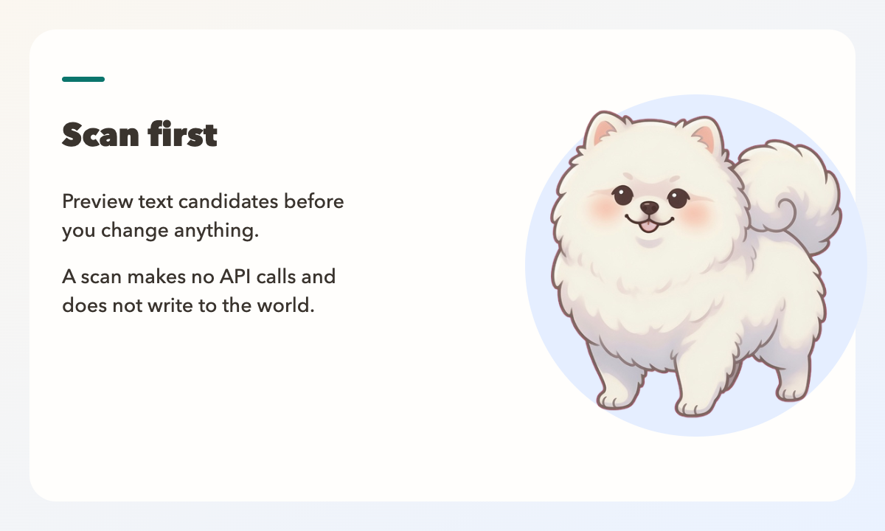
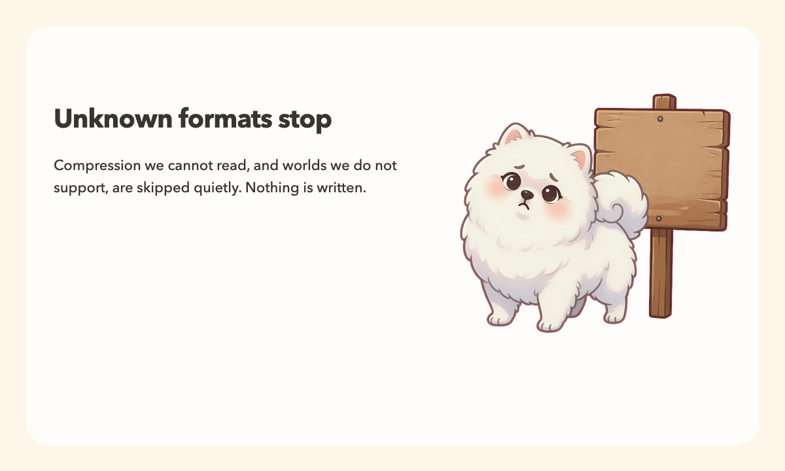
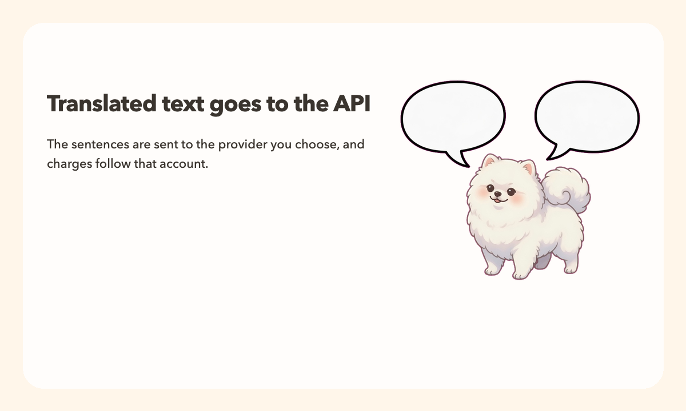
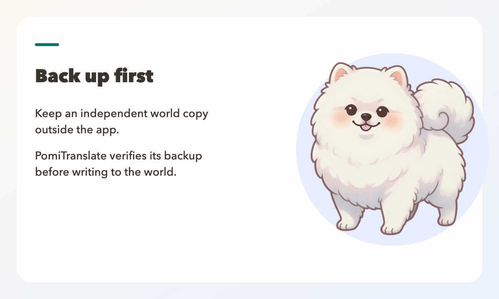

# PomiTranslate

World Translator for Minecraft

NOT AN OFFICIAL MINECRAFT PRODUCT. NOT APPROVED BY OR ASSOCIATED WITH MOJANG OR MICROSOFT.

Back up your world before translating. PomiTranslate writes to the world files you select.

Text you choose to translate is sent to the API provider you select and may incur charges.

PomiTranslate has no purchase, subscription, or in-app payment.


English | [한국어](docs/README.ko.md) | [日本語](docs/README.ja.md) | [简体中文](docs/README.zh.md)

PomiTranslate is a free, local translator for Java Edition world text. The mascot is Pomi. The GitHub repository name stays `Minecraft-World-Translator`.

The CLI and the Tauri desktop app use the same translator through a packaged JSONL sidecar. A translation writes only after a verified backup. Scan Only does not call a provider and does not change world bytes. Selectors, resource locations, numbers, coordinates, and formatting placeholders stay as they are.


## What it translates

- Signs, including legacy lines and modern front and back text
- Book pages, titles, and filtered titles
- Custom names, item names, and lore
- Direct text components and 1.20.5+ item components
- `tellraw`, `title`, `subtitle`, and `actionbar` command text
- Resource-pack `lang/*.json` files inside a zip, when that option is enabled



## Formats

Supported when the fixture suite passed:

- Region compression: gzip, zlib, uncompressed, and Minecraft 1.20.5+ LZ4 (`LZ4Block`)
- External chunks in `c.<x>.<z>.mcc` (compressed bytes only)
- Standard region folders, custom dimensions, and Paper-style sibling worlds that contain `level.dat`

Detected and not written:

- Bedrock
- Pre-Anvil `.mcr`
- `.linear`
- Unknown compression, including id 127

The generated list is [docs/support-matrix.md](docs/support-matrix.md). macOS Intel, Windows x64, and Linux x64 are not listed as supported platforms. The Linux package job builds an artifact; it was not smoked as a supported desktop platform.



## Providers

The product providers are OpenAI, Gemini, Anthropic, OpenRouter, and Custom. Custom speaks either the OpenAI chat format or the Anthropic messages format, using the base URL you set. Older Comet settings still load.

Before a real translation, PomiTranslate fetches that provider's text models and uses the published id, name, and context size. If the model you chose is not in that list, the run stops before it writes the world.

## Keys and settings

API keys are stored in the operating-system keychain under the service name `PomiTranslate`. The account name is the provider id, such as `openrouter`. Keys are not written to `settings.json`, SQLite, logs, or the git repository.

Public settings survive app updates. They live outside the install folder:

- macOS: `~/Library/Application Support/PomiTranslate/settings.json`
- Windows: `%APPDATA%\PomiTranslate\settings.json`
- Linux: `$XDG_DATA_HOME/PomiTranslate` or `~/.local/share/PomiTranslate/settings.json`

A model catalog for the provider is stored beside that file. The desktop settings screen can delete the selected provider's key from the keychain.



## Quick start

Python 3.12 is the tested runtime. The packaged desktop entry does not ask the end user to install Python.

```bash
python3 -m venv .venv
source .venv/bin/activate
python -m pip install -r requirements.txt
```

Scan a world. This does not call the provider and does not change the world:

```bash
python mc_world_translator.py --world-dir "/path/to/world" --dry-run --report-path ./scan-report.json
```

Translate after you have seen the scan. Pass the scan fingerprint so a world that changed in between is rejected:

```bash
python mc_world_translator.py \
  --world-dir "/path/to/world" \
  --provider openrouter \
  --model "your-text-model" \
  --expect-fingerprint "<fingerprint from the scan report>"
```

An empty `--api-key` uses the key already saved for that provider. `--list-models` prints the text models the provider returns.

Restore the latest verified backup:

```bash
python mc_world_translator.py --world-dir "/path/to/world" --restore-backup
```

Every write run creates a versioned backup set. Restoring puts back every file that run changed, including a second region such as `entities/` and an enabled world-local `resources.zip`, and first saves the current files as a recovery set. A write run also refuses to start while Java Edition's `session.lock` is held by Minecraft or a server.



## Desktop app

The desktop app uses Tauri 2 and Svelte 5. It provides Korean, English, and Japanese interface languages, recent-world selection, DataVersion information, structure-based compatibility status, Scan Only, candidate search and filters, exclusions, manual translations, a minimum request estimate before translation, provider and rate-limit settings, world-local `resources.zip` translation, progress and cooperative cancel, explicit resume of matching cancelled jobs, versioned backup history, and recovery-safe restore. The request estimate is a lower bound that excludes file boundaries and retries. Remaining requests are not estimated for resumed jobs, and cost stays unavailable when provider pricing is not verified. Interface language is separate from the translation target language. It does not open a localhost port. Resume is offered only when the current world fingerprint, scan plan, translation settings, and verified backup set still match.

Build the native app from source:

```bash
pnpm install --frozen-lockfile
pnpm sidecar:build
pnpm exec tauri build
```

The sidecar build requires Python 3.12 and PyInstaller 6.16.0. The end user does not need Python, Node, or Rust after packaging.

## Desktop protocol

`python -m mwt.desktop_entry` speaks JSONL on stdin and stdout. It does not open a localhost port. `--notices` and `--about` print the safety text. `--scan` and `--translate` use the same core as the CLI.

GitHub Actions builds a native PyInstaller sidecar and an unsigned Tauri package on Linux, macOS, and Windows. These artifacts are not listed as supported platforms until clean-machine installation and the release smoke suite pass. Without signing credentials, the release workflow does not publish a signed release.

## Local web UI

`webui_server.py` is still available when you already have Python. It binds to `127.0.0.1:8765` unless you change that. The packaged app does not need it.

```bash
python webui_server.py
```

On macOS, `run_web_ui.command` creates a virtual environment if needed and opens the browser.

## Configuration

[config.example.toml](config.example.toml) shows the fields. Leave `world_dir` empty until you point it at a world you own. Do not put an API key in that file.

## Tests

```bash
.venv/bin/python test_core.py
.venv/bin/python tests/test_release_fixtures.py
.venv/bin/python tests/test_providers.py
.venv/bin/python tests/test_brand_secrets.py
.venv/bin/python tests/test_desktop_entry.py
```

The release fixtures are the source of the support matrix.

## Contact

Questions and bug reports: `mini0227kim@gmail.com`

Include the operating system, provider, model, whether you used the CLI or the desktop entry, and the error text. Do not include your API key.

## License

MIT. See [LICENSE](LICENSE).
