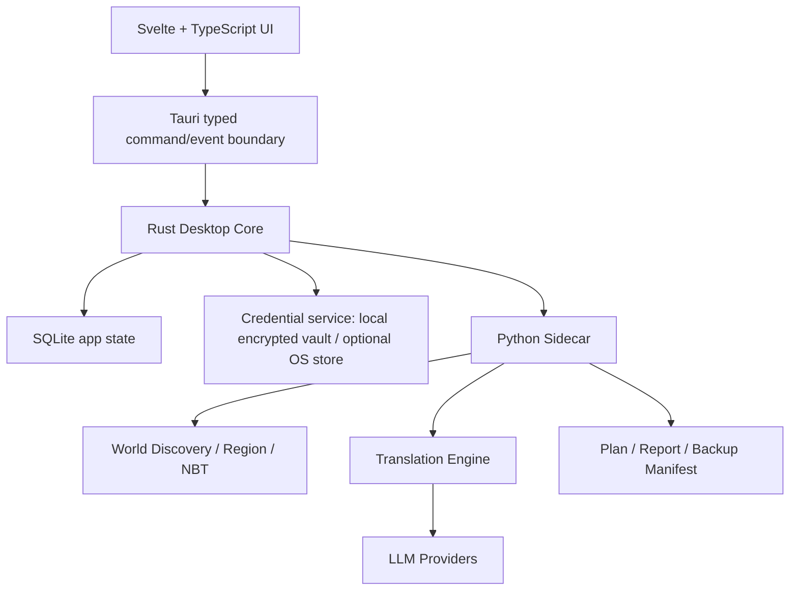

# PomiTranslate 🐾 데스크톱 앱 전환 구현 계획서 및 하위 에이전트 작업 지시서

> 현재 검증과 잔여 범위는 [현재 상태](current-state.md)와 [추후 작업](follow-up-work.md)을 따른다. 날짜별 기록은 이력이다.

> 2026-10-01 사용자 검증 최적화 결정은 [검증 실행 정책](verification-policy.md)과 [이전 중단 인계](history/phase2-pause-2026-10-01.md)를 따른다. 중간 checkpoint 저장은 Phase 완료가 아니다.

## 현재 작업 상태 — 2026-10-02

**Phase2 데스크톱 기능·macOS arm64 개발 환경 gate 완료 / Phase3 진행 중(COMP-01 완료) / release-ready 아님.** 현재 구현은 [current-state](current-state.md), 미완 gate는 [follow-up-work](follow-up-work.md), 최신 최종 증거는 [Phase2 완료 기록](history/phase2-completion-2026-10-01.md)을 따른다. 실제 OpenRouter 최소 E2E·startup 복구·Legacy 대체 범위·최종 .mcc 생성/복원/물리 집계와 관련 gate를 완료했다. provider-reported 추가 API 비용$0.0001484이며 최종 수동 gate의 추가 비용은0이다. 플랫폼·정식 배포/라이선스 gate는 남아 있다.

2026-10-02 작업 브랜치의 SNBT·Gemini·native UX·도움말·라이선스 뷰어·업데이트 연결·초기화·화면 모드를 main에 통합했다. [통합·대조 기록](history/main-integration-2026-10-02.md)의 구현/기존 검증/미검증 구분을 따른다. 이후 변경의 macOS native와 signed updater/release·SBOM gate는 남아 있다. 과거 서비스 소개 정리는 checkpoint 이력이다. 과거 key 대기·테스트 수·HEAD를 현재 상태로 복사하지 않는다.
아래 9월28~30일 관측은 역사 기록/장기 계획이며 현재 완료 증거가 아니다. 사용자 결정인 local encrypted credential 기본·keychain opt-in, 웹 선검증 후 native 최종 gate, Phase별 검증→commit→push 순서를 유지한다.

> 원격 인계용 사본: 프로젝트 루트 계획/기록을 제품 저장소에도 포함했다. 본문의 프로젝트 루트 경로는 기존 로컬 배치를 설명하며, 이 저장소만 clone한 경우 실행 명령은 clone 루트에서 수행한다.

> 제품명: **PomiTranslate 🐾**\
> 부제: **World Translator for Minecraft**\
> 한줄 설명: **Pomi가 도와주는 마인크래프트 월드/맵 번역 도구**\
> 저장소: `kim0040/PomiTranslate`\
> 문서 기준일: **2026-09-28 (Asia/Seoul)**\
> 문서 버전: **1.1-draft — PomiTranslate 브랜딩/고지 반영**\
> 기준 저장소 HEAD: `cf91bb5d7453202932bff548266a0cb6756be0c9` (`feat: harden map translation workflow`)
> 초기 구현 현황 (2026-09-28, 역사 기록; 현재 상태는 맨 위 current-state 참조): 1.0 안전 코어, CLI, JSONL 데스크톱 진입점, `LZ4Block`, 외부 `.mcc`, OpenAI/Gemini/Anthropic/OpenRouter/Custom, 지원 표, GitHub Actions가 `main`에 있다. Tauri/Svelte 화면은 아직 없다. 패키지는 PyInstaller 진입점이다. 보이는 상태는 `reference/Minecraft-World-Translator/docs/current-state.md`에 있다.\
> 대상: 구현 총괄 에이전트, 월드 포맷 담당, Python 코어 담당, Tauri/Rust 담당, Svelte UI 담당, LLM/번역 담당, CI·배포 담당, QA 담당\
> 목적: 기존 기능을 잃지 않고 **설치 후 바로 사용할 수 있는 데스크톱 앱**으로 전환하며, Java Edition 월드 형식 변화와 다양한 서버/런처 구조를 가능한 넓게 지원하고, 실제로 검증한 범위만 지원한다고 표시한다.

---

# 2026-09-30 계획 개정 — credential 저장과 후속 인계

문서 버전: **1.1 + 2026-09-30 개정**. 아래 개정은 과거 구현 현황과 충돌하는 경우 우선한다. 이 개정은 계획이며 구현 완료를 뜻하지 않는다.

- [실행 가능한 전체 인계 문서](history/agent-handoff-2026-09-30.md): 당시 Git 상태와 Phase2/3 작업 이력, 예산, 안전 경계, 실행 명령, 완료 보고 계약.
- [로컬 credential 저장 상세 계획](credential-storage-plan.md): 암호화 DB, 설치별 키 파일, 플랫폼 permission, migration, UX와 검증.
- [현재 제품 상태](current-state.md), [남은 작업](follow-up-work.md).

최신 사용자 결정: 반복되는 키체인 권한 요청을 줄이기 위해 **데스크톱 기본 저장을 로컬 암호화 DB로 계획 변경**한다. Rust가 API 키를 저장 시 AES-256-GCM으로 암호화하고 사용 시 복호화한다. 설치별 무작위 master key는 DB와 별도 사용자 전용 파일에 둔다. 키체인과 세션 전용 저장은 선택 기능이다. 통합 SQLite data layer는 아직 없으며 작은 credential vault부터 도입한다.

DB와 키 파일 모두에 접근할 수 있는 같은 사용자 프로세스는 복호화할 수 있다. OS 키체인과 동등한 보안이라고 표시하지 않는다. API 키 평문을 JSON/DB/로그/소스에 저장하지 않는 원칙, Rust→sidecar stdin 전달, provider/endpoint 격리는 유지한다. master key 하드코딩·자체 암호 알고리즘·무검증 migration·기존 credential 자동 삭제는 금지한다.

기존 OS 키체인 사용자를 시작 시 자동으로 읽지 않는다. 명시적인 가져오기 UI 또는 새 키 입력으로 migration하며, 로컬 모드 상태 조회·World/Scan/Review는 키체인 접근 없이 동작해야 한다. CLI와 legacy keyring 경로의 호환성은 별도로 유지한다.

실제 저장소 관측(2026-09-30): 제품 클론은 `main` / `e70d27a`, 작업 시작 전 clean이며 로컬 feature branch도 같은 commit이다. Phase 2 화면은 tracked 코드로 존재하지만 최종 완료 검증은 남았다. Phase 0/1 기반은 유지하며 **Phase 2 복구·credential 변경·전체 gate → docs/diff review → commit/push → Phase 3 → 검증/docs/commit/push** 순서를 따른다. 일반 feature push의 3 OS installer 자동 빌드는 하지 않는다. 최종 플랫폼 gate는 생략하지 않는다.

과거 본문의 milestone은 장기 설계이고 현재 완료 여부가 아니다. 현재 작업 상태와 재개 순서는 위 인계 문서를 기준으로 한다. 공개 릴리스·서명 자격·사용자 월드 외부 업로드는 별도 승인 대상으로 유지한다. 이전 후속 작업에서 명시 승인된 추가 API 테스트 총 $1 이내(목표 $0.01–$0.10)의 최종 최소 E2E 범위는 유지하되, 이번 요청은 문서 작성이므로 실제 호출하지 않는다.

---

## 2026-09-30 추가 개정 — 웹 선검증과 화면 비율 대응

최신 사용자 요청에 따라 같은 제품 Svelte 화면의 UI/UX·가능한 기능을 **브라우저에서 먼저 검증**한다. 정적/unit → 웹 fixture → 실제 Python/JSONL → frontend production build → 마지막 Tauri/native/패키지 E2E 순서다. 반복적인 UI 조정마다 sidecar/.app/installer를 다시 만들지 않는다. native credential/file chooser/패키징/실제 restore의 최종 검증은 유지한다.

화면은 width와 height에 유동적으로 대응해야 한다. 기존 viewport와 320px/200%에 더해 16:9, ultrawide, 세로형, 짧은 높이, breakpoint 전후 및 연속 resize에서 clipping/overlap 없는 접근·작업 완료, 선택/draft/focus 보존을 검증한다. 브라우저 mock 성공과 실제 backend/native 성공은 별도 증거로 보고한다.

현재 browser fixture를 유지·보강하고, 개발 bridge는 필요할 때만 production과 분리해 구현한다. [상세 browser 실행·반응형 계약](browser-first-testing-plan.md)이 후속 인계와 기존 장기 milestone의 검사 순서보다 우선한다. 이번 개정은 문서 계획이며 새 browser suite나 반응형 검증이 완료됐다는 뜻이 아니다.

# 제품명 및 공식 표기

## PomiTranslate 🐾

**World Translator for Minecraft** — Pomi가 도와주는 마인크래프트 월드/맵 번역 도구

> **NOT AN OFFICIAL MINECRAFT PRODUCT. NOT APPROVED BY OR ASSOCIATED WITH MOJANG OR MICROSOFT.**\
> 이 프로젝트는 Mojang Studios 또는 Microsoft와 관련이 없으며, 공식 승인을 받은 제품이 아닙니다.\
> "Minecraft"는 Mojang Synergies AB의 상표입니다.

## ⚠️ 유의사항 (Notice)

- **비공식 도구:** PomiTranslate는 개인이 만든 오픈소스 도구이며, Mojang/Microsoft와 무관합니다.
- **무료 프로젝트:** 이 도구는 무료로 제공되며 유료 판매·결제 기능이 없습니다. ([Minecraft EULA](https://www.minecraft.net/en-us/eula) 및 [Usage Guidelines](https://www.minecraft.net/en-us/usage-guidelines) 준수)
- **맵 저작권:** 번역한 맵의 원본 저작권은 원작자에게 있습니다. 번역본은 개인적으로만 사용하고, **원작자의 허락 없이 재배포하지 마세요.**
- **백업 필수:** 월드 파일을 직접 수정합니다. 자동 백업 기능이 있지만, 실행 전 월드를 따로 백업해 두는 것을 권장합니다.
- **API 키와 비용:** 번역은 사용자가 직접 입력한 API 키(OpenAI, Gemini, Anthropic, OpenRouter 등)로 동작하며, API 사용 요금은 각 제공사 정책에 따라 사용자에게 청구됩니다. API 키는 절대 공개 저장소나 다른 사람과 공유하지 마세요.
- **데이터 전송:** 번역할 텍스트는 선택한 API 제공사(또는 중계 서비스)로 전송됩니다. 일부 무료 등급(예: Gemini Free Tier)은 입력 데이터를 서비스 개선에 사용할 수 있습니다.
- **번역 품질:** 기계/AI 번역 결과는 부정확할 수 있으며, 명령어·JSON 텍스트가 깨질 수 있습니다. 드라이런(미리보기)으로 먼저 확인하세요.

## 제품명 사용 규칙

- 메인 제품명은 항상 **PomiTranslate**로 표기한다.
- 마스코트 이름은 **Pomi**로 표기한다.
- 제품 부제는 **World Translator for Minecraft**를 사용한다.
- `Minecraft World Translator`는 더 이상 메인 서비스명이 아니다.
- 2026-10-01 원격 응답과 양쪽 main SHA 비교로 GitHub 저장소가 `PomiTranslate`로 이동한 것을 확인했다. 로컬 checkout `reference/Minecraft-World-Translator`와 내부 `mwt`는 유지한다.
- 저장소 rename은 별도 migration 작업으로 취급하며 기존 링크, Release, Issue, clone URL 영향 여부를 먼저 확인한다.
- 설치 파일, 앱 타이틀, About 화면, README, GitHub Release, updater metadata, 로그의 product field는 새 제품명으로 통일한다.
- 내부 Python package/module 이름 `mwt`는 즉시 바꿀 필요가 없다. 안정성을 위해 내부 식별자와 사용자 노출 브랜드명을 구분한다.
- 공식 Minecraft 제품처럼 보일 수 있는 표현, 로고, 자산 사용을 피한다.
- `Minecraft`는 기능 설명을 위한 부제/본문에서 필요한 범위로 사용한다.

## 고지문 노출 위치

### README / 프로젝트 홈페이지
위의 전체 Notice를 제공한다.

### 앱 첫 실행
짧은 핵심 안내를 제공한다.

```text
PomiTranslate는 비공식 오픈소스 도구입니다.
Mojang/Microsoft와 관련이 없습니다.

월드 파일을 직접 수정하므로 중요한 월드는 별도로 백업해 주세요.
번역할 텍스트는 사용자가 선택한 AI API 제공사로 전송될 수 있으며,
해당 API 사용료가 발생할 수 있습니다.
```

사용자는 `[확인하고 시작]`을 눌러 진행할 수 있다. 이 확인은 복잡한 약관 시스템이 아니라 중요한 사용상 주의를 인지시키는 onboarding 단계다.

### 번역 실행 직전
다음 정보를 실제 설정값과 함께 보여준다.

```text
대상 월드
백업 상태
선택한 API 제공사
선택한 모델
외부로 전송될 텍스트 수
예상 요청 수/비용(계산 가능할 때)
맵 재배포 주의
```

### About 화면

- PomiTranslate 버전
- `World Translator for Minecraft`
- 비공식 제품 고지
- 오픈소스 라이선스
- Minecraft EULA / Usage Guidelines 링크
- GitHub 저장소
- Third-party notices

---

## 0. 이 문서의 성격과 최우선 원칙

이 문서는 다른 프로젝트의 계획서를 복사한 요구사항이 아니다. 기존 `Minecraft-World-Translator` 저장소의 현재 구현을 기준으로 새 데스크톱 제품을 구현하기 위한 독립적인 실행 계약이다.

기존 Moaum 계획서와 유사한 것은 다음의 **개발 원칙과 문서 세분화 방식**뿐이다.

- 최신 안정 기술 스택을 사용하되 실제 호환 조합을 CI에서 검증한 뒤 고정한다.
- 최종 사용자가 개발 런타임을 별도로 설치하지 않아도 되게 한다.
- 대형 빌드·멀티 플랫폼 빌드·호환성 검증은 GitHub Actions를 적극 사용한다.
- 하위 에이전트가 병렬 작업하더라도 계약과 파일 소유 범위를 명확히 한다.
- 기능 버튼만 만들어 놓고 실제 기능이 없는 상태를 완료로 보고하지 않는다.
- 데이터 손상 방지와 복구 가능성을 UI 외형보다 우선한다.
- “지원한다”는 문구는 fixture/실월드 검증 결과가 있을 때만 사용한다.

### 0.1 용어

- **MUST**: 반드시 충족해야 완료로 인정한다.
- **SHOULD**: 특별한 이유가 없다면 구현한다. 변경하면 ADR에 이유를 기록한다.
- **MAY**: 여유와 필요에 따라 구현한다.
- **검증됨(Verified)**: 자동 fixture + 실제 또는 생성된 대표 월드에서 읽기/쓰기 round-trip을 통과했다.
- **최선 지원(Best effort)**: 구조적으로 읽을 수 있지만 전체 회귀 매트릭스를 통과하지 않았다.
- **감지만 지원(Detected)**: 형식을 식별하여 안전하게 중단하고 사용자에게 이유를 설명한다.
- **미지원(Unsupported)**: 해당 형식에 쓰기 동작을 하지 않는다.

### 0.2 절대 금지

1. 지원 여부를 확인하지 않은 Minecraft 버전을 “전체 지원”이라고 표시하지 않는다.
2. 알 수 없는 리전 압축 방식이나 NBT 구조에 임의로 쓰기 작업을 하지 않는다.
3. 월드가 실행 중이거나 쓰기 충돌 위험이 있는 상태에서 경고 없이 수정하지 않는다.
4. 백업이 실제로 만들어졌는지 검증하지 않고 `백업 완료`라고 표시하지 않는다.
5. API 키를 브라우저 LocalStorage, 일반 설정 JSON/TOML, SQLite 평문 컬럼, 로그에 저장하지 않는다.
6. 유료 API 호출을 “연결 테스트”라는 이유로 사용자 확인 없이 실행하지 않는다.
7. 전사/번역 결과나 월드 파일을 앱 기능에 불필요하게 외부 서버로 전송하지 않는다.
8. 기존 Python 코어를 단순히 “Rust가 더 좋다”는 이유만으로 전면 재작성하지 않는다.
9. 기존 CLI 사용자를 깨뜨리는 변경을 GUI 편의만을 위해 강제하지 않는다.
10. CI에서 재현되지 않는 전역 환경 의존 빌드를 공식 릴리스로 사용하지 않는다.
11. 손상 가능성이 있는 파일 쓰기를 원본에 직접 덮어쓰는 단일 단계로 수행하지 않는다.
12. 새 GUI가 기존 스캔/번역/백업/체크포인트 기능보다 기능적으로 퇴보한 상태에서 기존 UI를 제거하지 않는다.

---

# 1. 현재 저장소 기준선

## 1.1 현재 파일 구조

현재 `main` 브랜치에는 대략 다음 구조가 있다.

```text
Minecraft-World-Translator/
├── .env.example
├── .gitignore
├── LICENSE
├── README.md
├── config.example.toml
├── docs/
│   ├── README.ko.md
│   ├── README.ja.md
│   └── README.zh.md
├── env_utils.py
├── llm_backends.py
├── mc_world_translator.py
├── requirements.txt
├── run_web_ui.command
├── test_core.py
├── webui_server.py
└── webui/
    ├── app.js
    ├── index.html
    └── styles.css
```

현재 `.github/workflows/`는 없다. 따라서 CI/CD는 이번 개편에서 신규 구축한다.

## 1.2 현재 사용 흐름

현재 일반 사용 흐름은 다음과 같다.

```text
Python 3.11+ 설치
→ venv 생성
→ requirements 설치
→ webui_server.py 실행
→ localhost 브라우저 UI 접속
→ 월드/모델/설정 입력
→ Scan Only
→ 실제 번역
```

macOS의 `run_web_ui.command`가 일부를 자동화하지만 Windows/Linux에서는 여전히 Python 환경 구성이 필요하다.

새 제품의 목표는 다음과 같다.

```text
GitHub Releases에서 설치 파일 다운로드
→ 설치
→ 앱 실행
→ 월드 선택
→ 스캔
→ 번역
```

최종 사용자는 다음을 따로 설치하지 않아야 한다.

- Python
- pip/venv
- Node.js
- pnpm
- Rust
- Cargo
- Tauri CLI
- 개발용 빌드 도구

단, Linux는 선택한 배포 형식과 배포판에 따라 WebKitGTK/FUSE 등 시스템 런타임 의존성이 존재할 수 있으므로 “모든 Linux에서 완전 무의존”이라고 홍보하지 않는다.

## 1.3 현재 기능 중 반드시 보존할 것

현재 구현에서 이미 가치가 있으므로 새 구조에서도 기능 동등성 또는 개선을 보장한다.

- 월드 `.mca` 스캔
- 표지판 텍스트
- 책 페이지
- 책 제목과 `filtered_title`
- 커스텀 이름
- 아이템 표시 이름과 Lore
- `tellraw`
- `title`
- `subtitle`
- `actionbar`
- 리소스팩 `lang/*.json`
- dry-run Scan Only
- 실제 실행 전 백업
- JSON 결과 리포트
- 체크포인트 저장/재개
- 번역 캐시
- 파일 오류 시 계속 진행 옵션
- 여러 LLM 공급자
- OpenAI 호환/Anthropic 호환 custom endpoint
- OpenRouter
- 모델 목록 조회
- 스타일 프리셋
- 사용자 커스텀 시스템 프롬프트
- RPM/TPM 제한
- 배치 크기
- 요청 timeout
- API 재시도
- 기존 `translate.py` 설정 상속
- CLI 실행
- UI 한국어/영어/일본어
- 현재 중국어 문서
- 스캔/실번역 동작 분리
- 월드 밖 경로 탈출 방지
- 같은 월드의 동시 쓰기 작업 방지
- 번역 설정과 체크포인트 fingerprint 일치 확인

### 1.4 현재 테스트 상태에 대한 해석

`test_core.py`가 존재하며 문자열 필터, 명령 JSON, 설정 병합 등 여러 동작을 검사한다.

그러나 **테스트 파일이 있다는 사실과 현재 모든 테스트가 모든 플랫폼/월드 버전에서 통과한다는 사실은 다르다.**

따라서 첫 구현 티켓에서 반드시 다음을 수행한다.

1. 기준 commit에서 기존 테스트를 그대로 실행한다.
2. 실패가 있으면 “기존 실패”로 기록한 후 원인을 분리한다.
3. 테스트가 부족한 월드 포맷 영역은 fixture를 추가한다.
4. GitHub Actions에서 동일 검사를 실행한다.
5. CI badge를 README에 추가하는 것은 실제 안정화 이후로 한다.

---

# 2. 현재 구현에서 확인된 핵심 위험과 호환성 공백

이 장은 새 기능 아이디어가 아니라 **현재 코드에서 먼저 해결해야 할 release gate**이다.

## 2.1 월드 디렉터리 탐색이 고정 목록 중심

현재 기본 스캔 경로는 다음에 가깝다.

```text
region
entities
DIM-1/region
DIM-1/entities
DIM1/region
DIM1/entities
```

장점은 단순하고 예측 가능하다는 점이다.

문제는 다음이다.

- 사용자 정의 dimension을 자동 발견하지 못할 수 있다.
- `dimensions/<namespace>/<dimension>/...` 구조를 기본 탐색하지 않는다.
- Bukkit/Spigot/Paper 계열에서 월드가 sibling directory로 분리된 구조를 자동 연결하지 않는다.
- 최신 월드 구조 변경이 생겨도 설정을 사용자가 직접 알아야 할 수 있다.
- `poi` 및 기타 보조 데이터는 현재 범위 밖이다.

### 개선 원칙

경로를 Minecraft 버전 숫자로만 하드코딩하지 말고 **실제 디렉터리 구조를 탐색**한다.

`WorldLayoutDetector`를 별도 모듈로 만든다.

결과 예시:

```json
{
  "edition": "java",
  "root": "/world",
  "layout": "vanilla_modern",
  "dimensions": [
    {
      "id": "minecraft:overworld",
      "regionDirs": ["region"],
      "entityDirs": ["entities"]
    },
    {
      "id": "minecraft:the_nether",
      "regionDirs": ["DIM-1/region"]
    },
    {
      "id": "example:moon",
      "regionDirs": ["dimensions/example/moon/region"]
    }
  ],
  "warnings": []
}
```

## 2.2 리전 압축 방식 지원 공백

현재 리전 payload 처리는 다음 compression id를 처리한다.

- `1`: gzip
- `2`: zlib/deflate
- `3`: uncompressed

최근 Java Edition은 LZ4 기반 리전 압축을 지원하며, 제3자 서버용 예약 압축 id도 존재한다.

따라서 신규 `RegionCodec`은 최소 다음을 구분해야 한다.

| 형식 | 처리 정책 |
|---|---|
| gzip | 읽기/쓰기 |
| zlib/deflate | 읽기/쓰기 |
| none | 읽기/쓰기 |
| LZ4 | 읽기/쓰기 |
| custom compression id 127 | 기본적으로 감지 후 안전 중단 |
| 알 수 없는 id | 감지 후 해당 청크/리전 쓰기 금지 |

알 수 없는 압축을 만났을 때 “손상”이라고 단정하지 않는다.

표시 예:

> 이 월드에는 현재 앱이 해석할 수 없는 사용자 정의 리전 압축이 포함되어 있습니다. 원본 보호를 위해 이 파일에는 쓰기 작업을 하지 않았습니다.

## 2.3 외부 oversized chunk `.mcc`

리전 파일에서 너무 큰 chunk가 외부 `.mcc` 파일을 사용하는 경우를 처리해야 한다.

현재 구현은 일반 `.mca` 내부 payload를 전제로 한다.

새 codec은 다음을 MUST 지원한다.

- 외부 chunk flag 감지
- 대응하는 `.mcc` 경로 결정
- `.mcc` 읽기
- 원본 hash 기록
- 변경 후 크기가 리전 내부 제한을 넘으면 외부 chunk로 안전하게 저장
- 기존 `.mcc`가 더 이상 필요 없게 되었을 때 바로 삭제하지 말고 commit 이후 정리
- 백업 manifest에 `.mcc` 포함
- crash 복구 journal에 `.mca`와 `.mcc`를 같은 작업 단위로 기록

## 2.4 최신 sign 구조

기존 `Text1`~`Text4`만으로는 최신 양면 sign 전체를 지원하지 못한다.

semantic adapter는 최소 다음 계열을 분리한다.

- legacy `Text1`, `Text2`, `Text3`, `Text4`
- `front_text`
- `back_text`
- 각 면의 messages
- filtered messages
- 최신 버전에서 추가된 sign 관련 item/block component

양면 sign은 “하나의 표지판”으로 UI에서 그룹화하되 번역 occurrence는 앞/뒤를 구분한다.

## 2.5 Minecraft 1.20.5 이후 item data components

과거에는 다음 형태가 흔했다.

```text
display.Name
display.Lore
pages
title
```

1.20.5 이후에는 item component 기반 구조가 중요하다.

최소 adapter 범위:

- `minecraft:custom_name`
- `minecraft:item_name`
- `minecraft:lore`
- `minecraft:writable_book_content`
- `minecraft:written_book_content`

기존 태그와 신규 component를 동시에 fixture로 유지한다.

## 2.6 최근 text component 구조 변화

최근 버전에서는 text component가 “JSON 문자열”로만 들어간다는 전제가 깨진다.

따라서 `TextComponentAdapter`는 다음 형태를 추상화해야 한다.

```text
Legacy:
TAG_String -> '{"text":"hello"}'

Modern:
NBT Compound -> {text:"hello"}
```

그리고 최소 다음 변화에 대응한다.

- JSON-wrapped string
- direct structured component
- list component
- `text`
- `translate`
- `with`
- `extra`
- `hoverEvent` / `hover_event`
- `clickEvent` / `click_event`
- 스타일 속성
- NBT interpreted text

serializer는 **원본 표현 형식을 가능한 유지**한다.

## 2.7 command parser가 정규식 중심

현재는 대표적인 `tellraw`와 `title` 계열을 처리하는 데 유용하지만, 복잡한 command syntax 전체를 정규식만으로 넓히면 깨질 가능성이 크다.

새 구조:

```text
CommandTextExtractor
├── TellrawAdapter
├── TitleAdapter
├── BossbarAdapter
├── TeamAdapter
└── UnknownCommand -> preserve
```

원칙:

- selector는 번역하지 않는다.
- resource location은 번역하지 않는다.
- 숫자와 좌표를 번역하지 않는다.
- JSON/SNBT text argument 내부 사용자 표시 문자열만 대상으로 한다.
- 파싱에 실패하면 원문 유지.
- “일단 LLM에 보내고 돌려받기” 방식 금지.

## 2.8 현재 NBT 의존성 노후화 위험

현재 `requirements.txt`는 `NBT>=1.5.1`에 의존한다.

이 라이브러리가 새 Python과 최신 Minecraft NBT 형식을 안정적으로 round-trip하는지는 별도 검증이 필요하다.

T00/T14에서 다음 후보를 실제 fixture로 비교한다.

- 현재 `NBT`
- `nbtlib`
- `mcworldlib`의 필요한 부분
- 다른 유지보수 중인 MIT/BSD/Apache 호환 NBT 라이브러리
- 필요한 경우 자체 최소 NBT/region layer

선정 기준:

1. 현재 Python stable 지원
2. 알려지지 않은 태그 보존
3. compound/list/string/array round-trip
4. root tag 보존
5. read/write 성능
6. 라이선스
7. 유지보수 상태
8. malformed input 처리
9. 큰 payload 처리
10. Windows/macOS/Linux 패키징

라이브러리를 바꾸는 것 자체가 목표가 아니다.

---

# 3. 제품 목표

## 3.1 한 줄 정의

**PomiTranslate는 Java Edition 월드와 관련 리소스의 플레이어 표시 텍스트를 안전하게 찾아, 검토하고, 원하는 언어로 번역한 뒤 원본을 복구 가능한 형태로 보존하는 로컬 데스크톱 도구이다.**

## 3.2 가장 중요한 사용자 경험

```text
앱 실행
  ↓
월드 선택
  ↓
호환성 검사
  ↓
Scan Only
  ↓
"무엇이 번역될지" 목록 확인
  ↓
언어·모델·스타일 선택
  ↓
예상 비용/범위/백업 확인
  ↓
번역 실행
  ↓
후처리 검증
  ↓
결과 요약 + 필요 시 복원
```

사용자가 NBT, Anvil, `.mca`, `DataVersion`, 압축 알고리즘을 알아야 하는 제품으로 만들지 않는다.

## 3.3 제품 배포/수익화 계약

PomiTranslate 자체는 **무료 오픈소스 도구**로 배포한다.

MUST:

- 앱 자체 유료 판매 기능 없음
- 구독 기능 없음
- 인앱 결제 없음
- 번역 API 비용은 사용자가 자신의 API 키로 각 공급자에게 직접 부담
- 앱이 사용자의 API 사용료를 중개/재판매하지 않음
- 유료 기능 잠금, 광고 시청 unlock, 결제 기반 tier를 기본 제품 요구사항에 추가하지 않음
- 후원 링크 등을 향후 추가하더라도 핵심 기능과 분리하고 앱 구매/기능 해제로 오인되지 않게 함

이 정책을 변경하려면 별도 제품/법률 검토를 거쳐야 하며, 하위 에이전트가 임의로 결제 SDK를 추가하면 안 된다.

## 3.4 기본 출시 범위

### Alpha

- 기존 Python 핵심 회귀 테스트
- 새 repository structure
- Tauri shell
- Python sidecar
- JSONL IPC
- 표준 월드 선택
- 기존 scan 기능 이전
- 호환성 preflight
- CI
- macOS Apple Silicon 개발 설치본

### Beta

- Svelte 정식 UI
- multi-world library
- 버전/구조 자동 탐지
- 현대 region codec
- LZ4
- `.mcc`
- 현대 sign
- item components
- scan candidate review
- credential service (기본 로컬 암호화 vault, OS keyring 선택)
- versioned backup/restore
- Windows x64
- Linux x64
- updater 초안

### 1.0

- 검증된 Java Edition compatibility matrix
- CLI parity
- resource pack folder/zip
- custom dimension
- Bukkit/Paper 분리 월드
- 번역 메모리
- glossary/override
- 비용/토큰 추정
- pause/cancel/resume
- 안전한 update
- migration
- signed update bundles
- 릴리스 CI
- 지원 범위 문서 자동 생성

### 후속

- `.linear` adapter
- Bedrock 별도 엔진
- datapack `.mcfunction` 고급 parser
- structure `.nbt` 고급 편집
- 서버 원격 월드 workflow
- 번역 QA용 LLM optional second pass
- 협업 translation project

---

# 4. 대상 플랫폼과 “추가 설치 없음” 계약

## 4.1 최종 사용자

공식 Release 설치본 사용자는 개발 기술 스택을 설치하지 않는다.

| 플랫폼 | 목표 배포 | 사용자 추가 개발환경 |
|---|---|---|
| macOS Apple Silicon | `.dmg` / `.app` | Python/Node/Rust 불필요 |
| macOS Intel | 별도 x64 또는 검증된 universal 전략 | Python/Node/Rust 불필요 |
| Windows x64 | NSIS 우선 | Python/Node/Rust 불필요 |
| Linux x64 | AppImage 우선 + 필요 시 `.deb` | Python/Node/Rust 불필요, 시스템 런타임 조건 명시 |

Tauri는 OS WebView를 사용한다.

Windows는 WebView2 설치 여부를 installer/preflight에서 확인한다. 지원하는 Windows에서는 이미 존재할 수 있지만 “무조건 있다”고 가정하지 않는다.

Linux는 WebKitGTK 등 런타임 차이가 있으므로 검증 배포판을 명시한다.

## 4.2 개발자

개발자가 이미 호환되는 Node/pnpm/Rust/Python을 설치했다면 **같은 툴을 다시 설치할 필요는 없다.**

하지만 project dependency restore는 필요하다.

예:

```bash
pnpm install --frozen-lockfile
```

Python 개발 환경은 lock 기반으로 복원한다.

중요한 점은:

> “내 컴퓨터에 이미 설치되어 있으니 그 버전을 공식 빌드가 사용”하는 구조는 금지한다.

공식 빌드는 lockfile/toolchain file/CI version을 따른다.

## 4.3 빌드 도구와 런타임의 구분

```text
개발/CI 전용
├── Node
├── pnpm
├── Rust
├── Cargo
├── Python
└── PyInstaller

최종 앱
├── Tauri executable
├── compiled Svelte assets
├── bundled Python sidecar
└── 필요한 앱 resource
```

PyInstaller sidecar는 Python interpreter와 dependency를 함께 묶는다.

---

# 5. 권장 기술 스택

## 5.1 기본

| 영역 | 선택 | 비고 |
|---|---|---|
| Desktop | Tauri 2 최신 안정 호환 조합 | native shell |
| UI | Svelte 5 + TypeScript | 기존 100KB급 단일 JS 분해 |
| Frontend build | Vite + pnpm | Node는 빌드 전용 |
| Native glue | Rust stable | 파일 dialog, lifecycle, updater, secret, sidecar |
| Core | Python | 기존 로직 재사용·리팩터링 |
| Sidecar package | PyInstaller | OS별 CI build |
| IPC | stdin/stdout JSON Lines | localhost server 제거 |
| App state | SQLite 권장 | 월드/스캔/작업/백업 이력 |
| User config | versioned JSON/TOML 또는 DB settings | key 제외 |
| Secret | Rust 로컬 암호화 vault / 선택적 OS credential | provider별 slot, master key는 DB와 분리 |
| Tests | pytest + Vitest + Rust tests + desktop smoke | |
| CI/CD | GitHub Actions | 일반 작업은 local check, manual/tag installer, 최종 cross-platform gate |
| Update | Tauri Updater + GitHub Releases | 서명 필수 |

## 5.2 작성일 관찰값

아래는 고정 정답이 아니라 착수 시 다시 조회할 snapshot이다.

- Tauri updater: 2.12.0 계열 확인
- PyInstaller: 6.22.3
- 최신 Tauri sidecar 기능은 외부 binary bundling 및 target triple별 binary를 지원
- PyInstaller는 Python interpreter를 포함하여 사용자 Python 설치를 요구하지 않음
- PyInstaller는 일반적으로 OS별 빌드가 필요하므로 GitHub Actions matrix와 잘 맞음

정확한 Tauri core/CLI/plugin/Svelte/Vite/Node/Rust/Python 버전은 **T00에서 registry와 공식 릴리스를 재조회**한다.

Python은 단순히 “최신이니까 최신”으로 정하지 않는다. 선택한 NBT 라이브러리와 PyInstaller가 함께 동작하는 가장 최신 안정 조합을 고정한다.

---

# 6. 목표 아키텍처



## 6.1 프로세스 역할

### Svelte

담당:

- 사용자 입력
- world library
- scan result
- candidate review
- progress
- restore UI
- settings
- logs view
- localization

직접 하면 안 되는 것:

- API key 원문 보관
- 월드 파일 직접 쓰기
- 백업 성공 판정
- 임의 path 접근
- sidecar executable path 결정
- provider Authorization header 처리

### Rust/Tauri

담당:

- 창 lifecycle
- single instance
- native folder/file dialog
- app data 위치
- sidecar spawn/kill
- JSONL message routing
- credential service (기본 로컬 암호화 vault, OS keyring 선택)
- updater
- filesystem scope
- one-world write lock
- crash detection
- desktop notifications 선택 기능
- DB connection 또는 app state service

### Python sidecar

담당:

- 기존 Minecraft 번역 core
- world structure discovery
- region codec
- NBT adapter
- semantic text extraction
- scan plan
- translation batching
- provider adapters
- checkpoint
- backup manifest
- write verification
- restore core
- CLI

## 6.2 production에서 localhost server 제거

현재:

```text
Browser → localhost HTTP server → Python core
```

목표:

```text
Svelte → Tauri/Rust → Python sidecar stdin/stdout
```

`webui_server.py`는 migration 동안 dev/legacy bridge로 유지할 수 있으나 1.0 production 경로에는 localhost listener를 요구하지 않는다.

## 6.3 Python CLI 유지

```text
                 shared python core
                 /                \
           Desktop sidecar        CLI
```

GUI와 CLI가 서로 다른 번역 규칙을 구현하면 안 된다.

---

# 7. IPC 계약

## 7.1 transport

UTF-8 JSON Lines.

한 줄 = 하나의 message.

stdout는 protocol 전용으로 사용한다.

일반 debug print는 stderr 또는 structured log event를 사용한다.

### 요청

```json
{"v":1,"id":"req-42","type":"scan.start","payload":{"worldId":"...","profileId":"..."}}
```

### 이벤트

```json
{"v":1,"id":"req-42","type":"scan.progress","payload":{"completed":12,"total":240}}
```

### 완료

```json
{"v":1,"id":"req-42","type":"response.ok","payload":{"scanRunId":"..."}}
```

### 오류

```json
{
  "v":1,
  "id":"req-42",
  "type":"response.error",
  "error":{
    "code":"REGION_COMPRESSION_UNSUPPORTED",
    "messageKey":"errors.regionCompressionUnsupported",
    "recoverable":true,
    "details":{"compressionId":127}
  }
}
```

## 7.2 protocol version

- 모든 message에 protocol `v`.
- sidecar startup 시 `hello`.
- 앱과 sidecar의 protocol major가 다르면 실행 중단.
- minor feature capability negotiation.
- UI가 존재하지 않는 capability 버튼을 표시하지 않는다.

### hello 예

```json
{
  "v":1,
  "type":"system.hello",
  "payload":{
    "sidecarVersion":"1.0.0",
    "protocolVersion":1,
    "capabilities":[
      "scan",
      "translate",
      "restore",
      "region.lz4",
      "region.external_chunk"
    ]
  }
}
```

---

# 8. 권장 저장 구조

```text
src/
├── lib/
│   ├── api/
│   ├── components/
│   ├── stores/
│   └── i18n/
├── features/
│   ├── worlds/
│   ├── scan/
│   ├── candidates/
│   ├── translation/
│   ├── jobs/
│   ├── backups/
│   └── settings/
└── routes/

src-tauri/
├── src/
│   ├── sidecar/
│   ├── commands/
│   ├── secrets/
│   ├── state/
│   ├── updater/
│   └── locks/
├── capabilities/
├── binaries/
└── tauri.conf.json

python/
├── mwt/
│   ├── core/
│   ├── worlds/
│   │   ├── discovery.py
│   │   ├── region.py
│   │   ├── nbt_backend.py
│   │   └── compatibility.py
│   ├── text/
│   │   ├── components.py
│   │   ├── signs.py
│   │   ├── books.py
│   │   ├── items.py
│   │   └── commands.py
│   ├── translation/
│   ├── providers/
│   ├── jobs/
│   ├── backups/
│   └── protocol/
├── cli.py
├── sidecar.py
└── tests/

tests/
├── fixtures/
│   ├── worlds/
│   ├── region/
│   ├── nbt/
│   ├── commands/
│   └── resourcepacks/
└── compatibility/

.github/
└── workflows/
```

기존 코드는 바로 삭제하지 않는다.

migration 동안 `legacy/` 또는 기존 경로에서 regression reference로 유지하고 parity 이후 정리한다.

---

# 9. SQLite 도입 범위

기존 단일 실행 도구만 유지한다면 SQLite는 불필요할 수 있다.

그러나 이번 목표에는 다음이 들어간다.

- 여러 월드 관리
- scan history
- candidate occurrence
- translation run
- job resume
- backup history
- restore
- glossary
- translation memory
- 호환성 결과
- 최근 월드

따라서 **앱 상태용 SQLite를 권장**한다.

월드 파일 자체는 DB에 넣지 않는다.

## 9.1 주요 테이블 제안

```text
app_meta
worlds
world_locations
world_dimensions
world_profiles
scan_runs
text_candidates
candidate_occurrences
translation_runs
translations
jobs
job_items
backup_sets
backup_files
glossary_entries
translation_memory
compatibility_checks
```

### `worlds`

- stable id
- display name
- canonical root
- edition
- detected layout
- last opened
- last scan
- compatibility status

### `candidate_occurrences`

- scan run
- candidate id
- dimension
- file relative path
- chunk coordinate
- NBT path
- semantic type
- DataVersion
- read-only context

### `backup_files`

- backup set
- relative source
- original hash
- backup hash
- size
- restore status

## 9.2 DB 원칙

- schema version
- immutable migration files
- WAL은 local app data에서만
- cloud/network folder에 app DB를 두지 않음
- migration 전 SQLite backup
- API 키 평문 금지
- cache는 재생성 가능
- 삭제 기능은 app state와 실제 월드를 구분

---

# 10. 월드 선택과 다중 월드 지원

## 10.1 기본 월드 라이브러리

왼쪽 영역 또는 홈 화면:

```text
최근 월드
- Trip to BrennenBurg REMAKE
- Adventure Map Test
- Paper Server World

[월드 열기]
[서버 월드 묶음 열기]
```

기본적으로 월드를 앱 내부로 복사하지 않는다.

원래 경로를 참조한다.

## 10.2 월드 감지

선택한 폴더에서 우선 다음을 확인한다.

- `level.dat`
- `region/`
- `entities/`
- `DIM-1`
- `DIM1`
- `dimensions/`
- 관련 sibling world
- `resources.zip`
- datapacks
- server.properties 선택적 힌트
- world metadata

Bedrock LevelDB 구조가 감지되면:

> Bedrock Edition 월드가 감지되었습니다. 현재 이 빌드는 Java Edition 월드만 안전하게 수정할 수 있습니다.

그리고 쓰기 금지.

## 10.3 Vanilla 구조

자동 탐지:

```text
world/
├── region/
├── entities/
├── DIM-1/
├── DIM1/
└── dimensions/
    └── namespace/
        └── dimension/
```

`dimensions/**/region`을 제한된 depth와 명시적인 구조 규칙으로 탐색한다.

전체 디스크 recursive scan 금지.

## 10.4 Bukkit/Spigot/Paper 계열

대표 구조:

```text
world/
world_nether/
└── DIM-1/
world_the_end/
└── DIM1/
```

또는 버전별 다른 layout이 존재할 수 있다.

사용자가 서버 root를 선택하면 관련 world folder 후보를 제시한다.

자동으로 sibling을 쓰기 대상으로 확정하지 않는다.

확인 UI:

```text
이 서버 월드에 연결된 차원을 찾았습니다.

✓ world             Overworld
✓ world_nether      Nether
✓ world_the_end     End

[3개 차원 함께 열기]
```

## 10.5 custom dimension

namespace와 dimension id를 그대로 보존한다.

예:

```text
dimensions/modid/moon
```

UI:

```text
modid:moon
```

사용자가 보기 좋게 별칭을 정할 수 있으나 파일 경로/ID를 변경하지 않는다.

## 10.6 launcher convenience

후속 또는 1.0 편의 기능으로 다음의 일반적인 save root를 **명시적 버튼으로** 탐색할 수 있다.

- Vanilla launcher
- Prism Launcher
- MultiMC
- Modrinth App
- CurseForge

자동으로 사용자 홈 전체를 recursive scan하지 않는다.

---

# 11. Minecraft 버전 지원 정책

## 11.1 버전 번호보다 구조 검증 우선

`level.dat`의 DataVersion은 중요한 힌트지만 모든 파일의 구조가 동일하게 업그레이드되었다고 가정하지 않는다.

특히 오래된 chunk와 새 chunk가 섞일 수 있다.

따라서:

```text
World DataVersion
+
각 NBT shape
+
region compression
+
directory layout
```

을 함께 본다.

## 11.2 지원 매트릭스 초안

| 계열 | 목표 |
|---|---|
| pre-Anvil `.mcr` | 감지, 초기에는 읽기/쓰기 미지원 가능 |
| Java 1.2.x ~ 1.12.x `.mca` | fixture 확인 후 legacy 지원 |
| 1.13 ~ 1.19.x | 주요 legacy NBT/text 지원 |
| 1.20 ~ 1.20.4 | 양면 sign 포함 |
| 1.20.5 ~ 1.21.4 | item data component + LZ4 포함 |
| 1.21.5 이후 | direct text component 변화 포함 |
| 26.x | 별도 최신 fixture 지속 갱신 |
| modded Java | vanilla 구조 + 알려진 modded NBT는 보존, 일반 문자열 자동 번역 금지 |
| Bedrock | 감지 후 미지원 |
| `.linear` | 초기 감지 후 미지원, 별도 adapter 후 승격 |

**이 표는 구현 목표이지 현재 지원 선언이 아니다.**

릴리스 README의 실제 표는 테스트 결과로 생성한다.

---

# 12. RegionCodec 상세 계약

## 12.1 read

`RegionCodec`은 다음을 제공한다.

```python
open_region(path)
iter_chunk_entries()
read_chunk(slot)
read_raw_chunk(slot)
decode_chunk(slot)
```

각 chunk metadata:

```text
slot
chunk x/z
sector offset
sector count
compression
external
compressed length
raw fingerprint
timestamp
DataVersion if parsed
```

## 12.2 write

수정되지 않은 chunk는 가능하면 raw payload를 그대로 복사한다.

수정된 chunk만 serialize/compress한다.

장점:

- 불필요한 NBT round-trip 감소
- unknown 데이터 보존
- 성능 개선
- diff 최소화

## 12.3 plan-first

실행 전:

```text
RegionWritePlan
├── original fingerprint
├── changed chunk list
├── expected external chunk changes
├── expected output size
├── backup target
└── validation rules
```

실행 직전 fingerprint가 다르면 plan 무효화.

## 12.4 commit

```text
1. backup 생성
2. backup hash 확인
3. temp region 작성
4. temp region 전체 header 검증
5. 변경 chunk 재parse
6. external chunk temp 작성
7. fsync 가능한 범위 적용
8. atomic replace/commit
9. orphan 임시 파일 정리
10. journal commit 기록
```

플랫폼별 atomic replace 차이를 테스트한다.

## 12.5 잘못된 chunk 하나 때문에 전체 파일을 잃지 않기

현재처럼 한 chunk parse failure가 region 전체 translation을 막는 것은 안전한 기본값이지만, 개선한다.

정책:

- scan에서 parse 실패 chunk를 개별 표시
- 읽지 못한 chunk는 raw preserve
- 읽을 수 있는 chunk만 후보로 수집
- 쓰기 시 unknown chunk raw payload를 그대로 보존할 수 있음이 검증된 경우에만 부분 수정
- header 자체가 불안정하면 region 전체 쓰기 금지

---

# 13. NBT Semantic Adapter

파일 포맷과 “번역할 의미”를 분리한다.

```text
RegionCodec
  ↓ raw NBT
NBT backend
  ↓
Semantic adapters
  ↓
TextCandidate
```

## 13.1 `TextCandidate`

```json
{
  "id":"...",
  "source":"Welcome traveler",
  "kind":"sign.front",
  "path":"front_text/messages/0",
  "dataVersion":3955,
  "writable":true,
  "context":{
    "dimension":"minecraft:overworld",
    "chunk":[12,-4]
  }
}
```

## 13.2 adapter 목록

### Signs

- legacy 4 lines
- modern front
- modern back
- filtered messages
- sign item/block component 변화

### Books

- legacy pages
- legacy title
- filtered title
- writable book
- written book
- modern component pages
- filtered pages

### Items

- `display.Name`
- `display.Lore`
- custom_name
- item_name
- lore
- nested item stacks

### Entities / Block Entities

- CustomName
- Text Display
- armor stand custom name
- container item names
- command block text argument

### Commands

- tellraw
- title/subtitle/actionbar
- bossbar visible name
- team prefix/suffix
- known safe text component arguments

### Generic text

기본 OFF.

알려지지 않은 NBT string을 전부 번역하는 기능은 위험하다.

고급 모드에서 후보 탐색만 가능하게 하고 자동 write는 별도 확인을 요구한다.

---

# 14. 번역 대상 필터

현재 namespace prefix blacklist를 확장하는 것만으로는 장기 유지가 어렵다.

새 엔진은 의미 기반으로 우선 판정한다.

### 자동 제외

- resource location
- UUID
- selectors
- commands
- coordinates
- registry keys
- block/item/entity IDs
- JSON key
- SNBT key
- URLs 선택 정책
- formatting-only
- 숫자-only
- checksum/hash
- file path
- scoreboard internal ID

### 자동 포함

semantic adapter가 “player-visible text”라고 보장한 field.

## 14.1 사용자 검토

스캔 화면에서:

| 원문 | 종류 | 위치 | 횟수 | 상태 |
|---|---|---|---:|---|
| Welcome! | 표지판 앞면 | overworld | 4 | 번역 |
| The Lost Key | 책 제목 | nether | 1 | 번역 |
| quest.main.id | 고급 후보 | custom | 7 | 확인 필요 |

사용자는 전체 제외/포함, occurrence 단위 확인을 할 수 있다.

---

# 15. 번역 엔진

## 15.1 provider 유지/정리

기존 provider 기능을 보존한다.

- OpenAI
- Gemini
- Anthropic
- OpenRouter
- Comet API
- custom OpenAI compatible
- custom Anthropic compatible

provider adapter interface 예:

```python
class TranslationProvider:
    def list_models(...)
    def validate_credentials(...)
    def translate_batch(...)
    def usage(...)
    def normalize_error(...)
```

## 15.2 API 키

설정:

```text
Provider
API Base URL
Model
API Key [저장됨]
```

API Key는 Rust credential service가 보관한다. 기본은 로컬 암호화 DB이며, OS secret store와 세션 전용 모드는 선택 기능이다. 상세 구현·migration·한계는 2026-09-30 개정 및 credential 저장 계획을 따른다.

Python sidecar가 요청해야 할 때만 Rust가 해당 job에 필요한 credential을 안전한 IPC 경로로 전달한다.

키를 sidecar command line argument로 넘기지 않는다.

process list에 노출될 수 있기 때문이다.

## 15.3 모델 조회

- 무료/비과금 metadata endpoint 우선
- 실패하면 수동 model ID 허용
- model 목록이 없는 custom endpoint 지원
- model이 사라져도 기존 profile 값을 삭제하지 않음
- 마지막 조회 시각 표시

## 15.4 번역 품질 보호

LLM이 다음을 바꾸지 않게 검증한다.

- formatting markers
- placeholders
- `%s`, `%1$s`
- `{0}`
- `%%`
- section formatting code
- click action value
- resource identifiers

`ProtectedTokenSet` 생성 후 요청 전후 비교.

불일치 시:

```text
검증 실패
→ 자동으로 원문 유지
→ 해당 candidate 재시도 가능
→ 사용자에게 이유 표시
```

## 15.5 glossary

프로젝트/전역 glossary:

```text
Brennenburg → 브레넨부르크
Redstone → 레드스톤
The Keeper → 수호자
```

종류:

- 강제 번역
- 번역 금지
- 선호 번역
- regex 고급 규칙

regex는 고급 모드에만.

## 15.6 manual override

스캔 결과에서 직접 번역을 입력하면 API 호출 없이 우선 적용 가능.

## 15.7 translation memory

동일 source + target language + relevant profile fingerprint를 재사용할 수 있다.

scope:

- 이 월드만
- 이 앱 전체

기본값은 월드 scoped 권장.

다른 월드의 민감하거나 맥락 의존 텍스트가 무심코 섞이지 않게 한다.

## 15.8 비용/시간 추정

구분:

- 예상 텍스트 수
- 예상 요청 수
- 추정 token
- provider 가격이 신뢰 가능할 때만 비용
- 가격 조회 시각
- 실제 usage가 응답되면 실제 사용량

`$0.00`을 “확인 불가” 대신 사용하지 않는다.

---

# 16. 리소스팩

## 16.1 입력

- world의 `resources.zip`
- 사용자가 추가한 ZIP
- resource pack directory
- modpack resource pack directory 선택 입력

## 16.2 언어 파일

```text
assets/<namespace>/lang/<locale>.json
```

namespace 여러 개 지원.

## 16.3 기존 target file 정책

현재처럼 source 전체를 target으로 생성하는 방법 외에 선택 정책을 제공한다.

기본 추천:

### Fill missing

기존 target의 번역은 유지하고 없는 key만 번역해서 채움.

다른 옵션:

- 기존 target 유지
- 없는 key만 채우기
- 선택한 key 덮어쓰기
- source 기준 전체 재생성

실행 전 diff count 표시.

## 16.4 JSON 안전성

- key 번역 금지
- value만 대상
- duplicate key/invalid JSON 경고
- encoding 검증
- ZIP path traversal 차단
- ZIP bomb 방지 한도
- 원본 ZIP backup
- temp ZIP 검증 후 replace

---

# 17. 백업과 복구

현재의 인접 `.bak_translate`는 간단하지만 반복 실행/다중 파일 작업에서 restore UX가 약하다.

새 시스템은 **버전된 backup set**을 사용한다.

예:

```text
2026-09-28 14:21
- 4 region files
- 1 resource pack
- model: ...
- target: ko
- source commit/app version
```

## 17.1 backup manifest

```json
{
  "backupSetId":"...",
  "worldId":"...",
  "createdAt":"...",
  "appVersion":"...",
  "files":[
    {
      "relativePath":"region/r.0.0.mca",
      "originalSha256":"...",
      "backupSha256":"...",
      "size":1234
    }
  ]
}
```

## 17.2 restore

사용자가:

```text
백업 기록
→ 2026-09-28 14:21
→ 상세
→ 복원
```

복원 전 현재 파일도 별도 recovery snapshot을 만드는 것을 기본으로 한다.

즉 restore를 했다고 새로운 변경을 영구 소실하지 않게 한다.

## 17.3 전체 월드 복제

고급 안전 옵션:

`작업 전에 월드 전체 복제`

큰 월드에서는 용량이 크므로 기본 OFF.

필요 공간을 먼저 계산한다.

---

# 18. 월드 실행 중 보호

쓰기 작업 전 preflight:

- directory writable
- free disk
- app write lock
- 동일 앱 job
- known Minecraft/server lock signal
- 최근 파일 변동
- scan 이후 fingerprint 변경

실행 중 월드로 의심되면 기본:

```text
월드가 다른 프로그램에서 사용 중일 수 있습니다.

Minecraft 또는 서버를 종료한 뒤 다시 시도하는 것을 권장합니다.

[다시 확인]
[취소]
[고급: 위험을 이해하고 계속]
```

고급 override 여부는 실제 lock semantics를 조사한 뒤 결정한다.

공식 release에서는 안전하지 않은 bypass를 쉽게 노출하지 않는다.

---

# 19. 작업 상태와 재개

## 19.1 상태

```text
Queued
Preflight
Scanning
AwaitingReview
Preparing
Translating
Writing
Verifying
Succeeded
PartiallySucceeded
Failed
Cancelled
Interrupted
NeedsAttention
```

## 19.2 cancel

- 아직 보내지 않은 API 요청 중단
- 이미 전송된 요청은 과금될 수 있음
- 파일 write 중에는 안전한 commit boundary까지 취소를 지연할 수 있음
- “취소 버튼을 눌렀다 = 이미 보낸 API 비용 0”이라고 표시하지 않음

## 19.3 resume

다음 fingerprint가 동일할 때만 자동 resume 후보.

- world identity
- relevant file hashes/generation
- provider/model
- target language
- prompt
- glossary
- scan scope
- component adapter version
- translation strategy version

달라지면 새 run 생성.

---

# 20. UI/UX

## 20.1 디자인 목표

게임 런처처럼 과하게 장식하지 않고 “안전한 데스크톱 유틸리티” 느낌.

Minecraft 공식 자산/로고를 그대로 UI theme로 복제하지 않는다.

### 기본 화면

왼쪽:

- 홈
- 최근 월드
- 월드 목록
- 백업
- 설정

중앙:

- 선택 월드
- 호환성 상태
- Scan
- 최근 작업

### 월드 화면 탭

- 개요
- 번역 후보
- 리소스팩
- 작업
- 백업
- 세부 정보

## 20.2 첫 실행

```text
Minecraft World Translator

월드의 플레이어 표시 텍스트를 찾아
검토 후 안전하게 번역합니다.

[월드 열기]

최근 월드 없음
```

처음부터 API 키를 강제로 요구하지 않는다.

Scan Only는 API 키 없이 사용 가능해야 한다.

## 20.3 월드 열기 결과

```text
Trip to BrennenBurg REMAKE

Java Edition
✓ Overworld
✓ Nether
✓ End
+ Custom dimensions 2

호환성 검사
✓ Region format
✓ Compression
! 최신 형식 일부 검토 필요

[스캔 시작]
```

## 20.4 scan 결과

상단:

```text
번역 후보 1,284
위치 2,992
확인 필요 12
미지원 파일 0
```

filter:

- sign
- book
- item
- entity
- command
- resource pack
- 확인 필요
- 제외
- 이미 번역 있음

## 20.5 번역 실행 전 확인

```text
대상: 한국어
모델: openrouter / ...
후보: 1,214개
제외: 70개

백업:
✓ 변경 대상 파일 백업

예상:
요청 약 ...
비용 약 ... / 확인 불가
시간 약 ...

[번역 시작]
```

실제 과금 단위를 모르면 비용 숫자를 꾸며내지 않는다.

## 20.6 진행 화면

```text
번역 684 / 1,214
██████████░░░░

현재:
아이템 이름 32개 처리 중

파일 쓰기:
아직 시작하지 않음

[일시정지]
[취소]
```

번역과 파일 write 단계를 구분한다.

## 20.7 완료

```text
번역 완료

1,203개 적용
11개 원문 유지
5개 경고

변경 파일 8
백업 세트 생성됨

[결과 보기]
[백업 보기]
[월드 폴더 열기]
```

---

# 21. 설정

## 21.1 일반

- UI 언어
- theme system/light/dark
- font size
- density
- 최근 월드 보관 수
- update 확인
- diagnostic opt-in

## 21.2 번역

- 기본 target language
- provider
- model
- style
- glossary
- translation memory
- temperature
- batch size
- RPM
- TPM
- request timeout
- retry
- concurrency

## 21.3 월드 호환성

일반 사용자에게는 기본값 숨김.

고급:

- custom scan roots
- generic text candidates
- unknown component behavior
- unsupported region handling
- experimental adapter

위험 옵션마다 설명.

## 21.4 백업

- backup root
- retention
- backup before write MUST 기본 ON
- full world clone 옵션
- restore history

백업 자동 삭제는 보관 규칙을 사용자에게 보여준다.

## 21.5 개인정보/보안

- 저장된 provider credential 목록
- 키 삭제
- 로그 경로
- 로그에서 path redaction
- translation memory 삭제
- 앱 데이터 삭제

월드 원본은 “앱 데이터 삭제”로 삭제하지 않는다.

## 21.6 업데이트

- stable channel
- 자동 확인
- 자동 다운로드 optional
- 설치는 사용자에게 알림
- release notes
- 현재 version

---

# 22. 다국어

기존 UI 언어를 최소 보존:

- 한국어
- 영어
- 일본어

중국어 문서가 이미 존재하므로 다음 단계에서:

- 중국어 간체
- 중국어 번체

리소스 분리 고려.

번역 target language는 UI 언어와 별도이며 임의 문자열도 가능해야 한다.

버튼은 영어 기준 폭에만 맞추지 않는다.

---

# 23. 접근성

MUST:

- keyboard navigation
- focus visible
- focus trap
- dialog Esc
- destructive action cancel default
- ARIA labels
- color-only status 금지
- progress live region 과도한 반복 금지
- reduced motion
- 200% UI scaling 검증
- macOS/Windows high-DPI
- 긴 파일 경로 tooltip/복사

---

# 24. 보안

## 24.1 Tauri capability

최소 권한.

Frontend가 일반 shell command를 임의 실행하지 못하게 한다.

허용 sidecar 명시.

임의 executable path 금지.

## 24.2 path

모든 write path는 Rust/Python에서 다시 검증.

UI validation을 신뢰하지 않는다.

## 24.3 secret

- credential service (로컬 암호화 vault 기본, keyring 선택)
- 로그 redact
- panic dump에 키 포함 금지
- command line 인자 금지
- updater private signing key repository 금지

## 24.4 network

LLM 호출은 사용자가 선택한 provider host로만.

custom base URL은 사용자가 명시적으로 설정.

redirect에 Authorization 전달 정책 검토.

update endpoint는 HTTPS.

## 24.5 번역 데이터 전송 고지

PomiTranslate는 로컬에서 월드 파일을 스캔하지만, 사용자가 실제 AI 번역을 실행하면 번역 대상 텍스트가 선택한 API 제공사 또는 사용자가 지정한 중계 서비스로 전송될 수 있다.

MUST:

- Scan Only는 번역 API를 호출하지 않는다.
- 실제 번역 직전에 현재 provider/base URL을 표시한다.
- custom endpoint 사용 시 특히 명확히 표시한다.
- API provider의 데이터 사용/보관 정책을 앱이 대신 보증하지 않는다.
- 특정 provider의 무료/유료 tier 정책은 변할 수 있으므로 앱 문구를 영구 사실처럼 하드코딩하지 않는다.
- 사용자가 현재 이용 중인 provider 정책을 확인할 수 있는 링크 또는 설명 위치를 제공할 수 있게 설계한다.
- 로그에 번역 전체 텍스트를 기본 저장하지 않는다.
- provider로 보내는 데이터 범위를 최소화한다.
- 월드 파일 전체를 provider로 업로드하지 않는다. 필요한 번역 후보 텍스트와 필요한 최소 문맥만 전송한다.

## 24.6 맵 저작권 및 재배포 안내

PomiTranslate는 번역 기술을 제공하는 도구이며, 사용자가 선택한 맵/월드에 대한 재배포 권한을 부여하지 않는다.

MUST:

- README에 원작자 권리 존중 안내.
- 앱 About/도움말에서 재배포 주의 확인 가능.
- 번역 결과 export 시 “이 도구가 배포 권한을 부여하지 않는다”는 설명 제공 가능.
- PomiTranslate가 번역된 맵의 소유권을 주장하지 않는다.
- 맵 원본/번역본을 PomiTranslate 서버로 자동 업로드하지 않는다.
- 사용자 월드를 CI fixture나 bug report에 자동 첨부하지 않는다.
- 실제 월드 파일을 공유하려 할 때 사용자가 직접 선택하는 명시적 행동이 필요하다.

기본 안내 문구:

> 번역한 맵의 원본 저작권은 원작자에게 있습니다. 개인적인 사용을 기본으로 하며, 원작자의 허락 없이 번역본을 재배포하지 마세요.

---

# 25. 로그와 진단

structured log.

```json
{
  "time":"...",
  "level":"warning",
  "code":"REGION_CHUNK_PARSE_FAILED",
  "worldId":"...",
  "relativePath":"region/r.0.0.mca",
  "chunk":[3,5]
}
```

기본 로그에:

- API key 금지
- 전체 prompt 기본 비기록
- 전체 번역 텍스트 기본 비기록
- 사용자 홈 절대 경로는 UI 진단 export에서 redaction 선택

진단 export:

- app version
- platform
- sidecar version
- protocol
- compatibility summary
- error codes
- sanitized logs

---

# 26. GitHub Actions 정책

2026-09-30 우선 정책: 현재 실제 workflow는 Python main push/PR + 관련 paths, installer manual/release tag이며 수동 기본 Linux다. 아래 장기 CI 설계가 feature push마다 전체 OS installer를 요구하는 것으로 읽히면 최신 인계의 절약 정책을 우선한다. 최종 release cross-platform gate는 유지한다.

로컬 SSD/CPU 사용을 최소화한다.

## 26.1 `ci.yml`

트리거:

- pull_request
- push main

jobs:

### Python

- dependency lock restore
- lint
- unit test
- fixture tests
- optional type check

### Frontend

- pnpm frozen lock
- formatting
- lint
- `svelte-check`
- Vitest

### Rust

- fmt
- clippy
- unit tests

### Contract

- generated IPC schema diff
- Python/Rust/TS fixture contract
- DB migration test

가능한 검사만 path filter로 분리하되 contract 변경 시 전체 relevant test를 실행.

## 26.2 `desktop-build.yml`

수동 + main smoke.

matrix:

- macOS Apple Silicon
- macOS x64 가능한 runner/전략
- Windows x64
- Ubuntu x64

각 job:

```text
checkout
→ toolchain restore/cache
→ Python sidecar build
→ sidecar smoke
→ target triple rename
→ frontend build
→ Tauri build
→ bundle smoke
→ artifact upload
```

PyInstaller가 OS별 build를 요구하므로 **sidecar를 Linux에서 Windows용으로 억지 cross-build하지 않는다.**

## 26.3 `compatibility.yml`

수동 + nightly/weekly 적절한 주기.

fixture matrix:

- legacy sign
- modern sign
- old item
- data component item
- old book
- modern book
- zlib
- gzip
- none
- LZ4
- external `.mcc`
- custom dimension
- malformed region
- unknown compression
- resource pack
- direct text component

각 fixture:

```text
scan
→ expected candidates
→ apply deterministic fake translations
→ write
→ reopen
→ invariants
→ restore
→ original hash
```

실제 유료 LLM을 CI에서 호출하지 않는다.

Provider network contract test는 mock.

## 26.4 `release.yml`

tag `v*`.

1. CI green 확인
2. platform packages
3. sidecar checksum
4. Tauri updater artifact
5. signature
6. macOS signing/notarization
7. Windows signing 가능한 경우
8. SBOM
9. third-party notices
10. release notes
11. GitHub Release
12. `latest.json`

실제 signing credential이 없는 PR에서는 unsigned draft artifact까지만.

## 26.5 `dependency-audit.yml`

주기적:

- Rust audit
- npm/pnpm audit 적절한 정책
- Python advisory
- license inventory
- lockfile drift
- dependency update PR

major 자동 merge 금지.

---

# 27. 자동 업데이트

Tauri updater를 사용한다.

GitHub Releases의 `latest.json`을 기본안으로 사용 가능.

MUST:

- updater artifact 서명
- public key 앱에 포함
- private key GitHub secret 또는 안전한 signing 환경
- TLS
- current work flush
- write job 중 즉시 update 금지
- restart 전에 sidecar 종료
- app state 유지
- credential service (기본 로컬 암호화 vault, OS keyring 선택) 유지
- 월드 데이터 건드리지 않음

업데이트와 OS code signing은 별개의 보안 문제로 관리한다.

---

# 28. 앱 데이터 유지

업데이트로 다음이 초기화되면 안 된다.

- 최근 월드
- world profile
- glossary
- translation memory
- scan/run history
- backup manifest
- settings
- credential vault/선택적 keyring credential과 설치별 암호화 키

앱 실행 binary 경로에 사용자 데이터를 저장하지 않는다.

migration:

```text
lock
→ DB backup
→ migration
→ invariant check
→ commit
```

실패하면 빈 DB를 새로 만들어 “데이터 없음”으로 보이게 하지 않는다.

---

# 29. 구버전 앱 migration

기존 사용자를 고려한다.

## 29.1 기존 config

import 지원:

- `config.example.toml`과 같은 구조
- 기존 사용자 TOML
- `.env`
- `translate.py`의 허용된 literal setting

API 키를 import할 때:

1. 원본에서 읽음
2. 사용자 선택 credential store에 암호화 저장 및 검증
3. 새 DB/config에는 키 원문 저장하지 않음
4. 원본 파일을 자동 삭제하지 않음
5. migration 결과 안내

## 29.2 checkpoint

기존 checkpoint는 새 engine과 정확히 호환되지 않을 수 있다.

자동 resume하지 않는다.

읽어서:

- 이전 작업 존재
- 사용 가능한 translation cache import 가능 여부

를 판단.

## 29.3 legacy Web UI

desktop 기능 parity가 확인될 때까지 유지.

1.0 이후 deprecated 문서로 이동 가능.

---

# 30. 성능 목표

숫자를 먼저 마케팅하지 말고 CI fixture와 큰 테스트 월드에서 측정한다.

원칙:

- 전체 월드를 RAM에 올리지 않는다.
- region 단위 또는 chunk 단위 처리.
- candidate occurrence는 paging.
- UI에 10만 행 DOM 생성 금지.
- virtualized table.
- scan event 초당 적정 빈도로 merge.
- hash는 필요할 때 background.
- API batch와 disk job 분리.
- 한 월드 write job은 기본 직렬.
- 여러 region parse는 안전한 범위에서 제한 concurrency.

큰 modpack/server world를 대상으로 performance fixture를 만든다.

---

# 31. CLI 계약

기존 CLI를 계속 지원한다.

신규 명령 구조 예:

```bash
mwt scan /path/to/world
mwt translate /path/to/world --profile ...
mwt compatibility /path/to/world
mwt backups /path/to/world
mwt restore <backup-id>
mwt models --provider openrouter
```

기존 flag는 deprecation 기간을 둔다.

CLI와 Desktop이 동일 core를 호출한다.

---

# 32. 추가 기능 제안

## 32.1 번역 미리보기

선택한 10~20 candidate만 먼저 번역.

유료 호출 전에 예상 비용 표시.

## 32.2 Context 묶기

동일 책/표지판/명령 블록에서 연관 문장을 같이 보내 문맥을 개선.

단:

- batch 내 mapping 유지
- 다른 맥락 문자열을 임의 합치지 않음
- 결과 분리 검증

## 32.3 고유명사 사전 자동 제안

scan 결과에서 반복되는 capitalized term 등을 단순 제안할 수 있다.

자동 확정 금지.

## 32.4 번역 비교

원문 / 현재 번역 / 새 번역.

사용자가 개별 승인 가능.

## 32.5 Export / Import

- candidate CSV
- candidate JSON
- glossary CSV/JSON
- translation map JSON

오프라인으로 사람이 번역하고 다시 import 가능.

## 32.6 “번역하지 않을 것” preset

Minecraft identifier / common game terms 보존.

사용자에게 preset 내용을 볼 수 있게 한다.

## 32.7 변경 diff summary

실행 전에:

```text
region files: 8
chunks: 53
strings: 1,203
resource files: 4
```

NBT raw diff를 일반 사용자에게 강요하지 않는다.

---

# 33. `.linear`와 특수 서버 포맷 정책

일부 서버 fork가 표준 Anvil 외 region format을 사용할 수 있다.

초기 1.0:

- `.linear` 발견
- 해당 dimension/region을 unsupported로 표시
- 절대 무시한 채 “전체 스캔 성공” 표시하지 않음
- 다른 표준 region은 계속 scan 가능
- 전체 번역 실행 전 부분 미지원 사실을 사용자에게 알림

후속 adapter는 별도 ticket으로 구현하며 실제 server fixture가 있어야 지원 표시.

---

# 34. 테스트 fixture 설계

실제 저작권 있는 배포 월드를 repository에 대량 포함하지 않는다.

최소 synthetic fixture를 생성한다.

## 34.1 region fixture

각각 아주 작은 region.

- zlib
- gzip
- none
- lz4
- external chunk
- unknown custom compression
- malformed header
- malformed one chunk
- empty region

## 34.2 semantic fixture

각 버전 형태별:

- sign
- books
- item
- lore
- custom name
- display entity
- command block
- resource pack
- custom dimension

## 34.3 round-trip invariant

수정 대상 외 값은 동일해야 한다.

가능하면:

```text
before semantic tree
after semantic tree
```

비교.

binary 전체 동일을 요구하지 않는 serializer 변경과, 실제 의미 보존을 구분한다.

---

# 35. 에이전트 역할

## A0 — 총괄/아키텍처

소유:

- architecture
- protocol
- shared contracts
- ticket dependency
- merge
- ADR
- release gate

임의로 모든 기능을 직접 구현하지 않는다.

## A1 — Minecraft 포맷/호환성

소유:

- world discovery
- region codec
- NBT
- DataVersion adapters
- fixtures

## A2 — Python Core/Job

소유:

- existing core refactor
- scan plan
- translation execution
- checkpoint
- backup
- CLI
- sidecar protocol Python side

## A3 — Tauri/Rust

소유:

- desktop shell
- sidecar lifecycle
- credential service (로컬 암호화 vault 기본, keyring 선택)
- SQLite service
- updater
- filesystem scope
- app lock

## A4 — Svelte/UI

소유:

- screens
- components
- stores
- i18n
- accessibility
- candidate table
- settings UI

## A5 — LLM/번역 품질

소유:

- providers
- model catalog
- token protection
- glossary
- translation memory
- estimates
- retry

## A6 — CI/Release

소유:

- Actions
- packaging
- signing
- updater release
- SBOM
- dependency/license audit

## A7 — QA

소유:

- acceptance scenarios
- regression
- packaged clean-machine smoke
- platform matrix
- bug reproduction fixtures

---

# 36. 에이전트 공통 실행 규칙

1. 작업 시작 전 `git status`, current commit, branch 확인.
2. `AGENTS.md`가 생기면 가장 먼저 읽는다.
3. 다른 agent 소유 파일을 대규모 수정하지 않는다.
4. shared contract 변경은 A0와 조정.
5. 기존 behavior를 지울 때 regression test 선행.
6. 사용자 승인 없이 유료 API test 금지.
7. 사용자 실제 월드를 fixture repository로 commit 금지.
8. secret commit 금지.
9. 임시 mock 성공을 production 성공으로 보고하지 않는다.
10. 큰 multi-platform build는 GitHub Actions 우선.
11. 로컬에서 모든 platform build를 시도하느라 용량을 낭비하지 않는다.
12. CI artifact를 handoff에 남긴다.
13. 기능이 미완성이면 UI에서 “완료 기능”처럼 노출하지 않는다.
14. unsupported world를 조용히 skip하지 않는다.
15. 코드 변경과 문서 갱신을 같은 ticket 완료 조건에 포함한다.

---

# 37. 브랜치/병렬 작업 규칙

권장:

```text
agent/T11-region-lz4
agent/T30-tauri-sidecar
agent/T33-scan-ui
```

가능하면 git worktree 사용.

shared contract:

- `contracts/`
- DB migrations
- protocol schema
- top-level config

는 동시 변경을 최소화한다.

큰 refactor 전에 baseline commit 기록.

---

# 38. Handoff 형식

모든 ticket 완료 시 다음 파일 또는 PR comment 형식 사용.

```markdown
# <Ticket> Handoff

- 기준 commit:
- 결과 commit:
- branch:
- 상태: 미시작 / 진행 / 구현완료 / 검증완료 / 차단
- 구현한 사용자 동작:
- 변경 파일:
- shared contract 변경:
- DB migration:
- 새 dependency:
- dependency version/license:
- Minecraft 버전/포맷 영향:
- 실행한 테스트:
- CI run:
- CI artifact:
- 패키징 검증:
- 데이터 손상/복구 영향:
- API 비용 영향:
- secret 영향:
- 미지원/미검증:
- 알려진 결함:
- 다음 담당자가 시작할 위치:
- 재현 절차:
```

---

# 39. 구현 티켓

## M0 — 기준선·도구·계약

### T00 저장소 기준선과 현재 기능 검증 — A0/A7

- current main commit 고정
- 기존 unit test 실행
- CLI smoke
- Web UI smoke
- dry-run fixture
- 실제 쓰기 synthetic fixture
- 현재 failure 목록
- 현재 성능 간단 측정
- `.github/workflows` 부재 기록

산출물:

- `docs/current-state.md`
- `docs/history/test-baseline.md`

완료:

- “기존에 무엇이 실제로 된다”를 테스트 근거로 설명할 수 있음.

### T01 기술 스택 최신 호환 조합 확정 — A0/A3/A6

공식 registry/문서 재조회:

- Tauri
- Tauri CLI/JS
- shell plugin
- updater
- Svelte
- Vite
- TypeScript
- Node
- pnpm
- Rust
- Python
- PyInstaller
- NBT candidate

CI smoke로 최소 shell build.

산출물:

- `docs/versions.md`
- `docs/adr/0001-desktop-stack.md`
- lockfiles
- toolchain files

완료:

- alpha/beta/nightly 없는 안정 조합
- 정확한 version pin
- 최신판을 못 쓰면 이유 기록

### T02 GitHub PR CI — A6

- Python
- frontend
- Rust
- contract
- basic fixture

완료:

- PR에서 자동 green/red.

### T03 Protocol/Schema 계약 — A0/A2/A3/A4

- JSONL protocol
- error code
- capability
- schema fixture
- protocol version

완료:

- Python/Rust/TS 동일 fixture 검증.

### T04 SQLite schema — A0/A3

- schema
- migration
- backup
- test

완료:

- fresh app/restart/migration.

### T05 PomiTranslate 제품명/고지 migration — A0/A4/A6

작업:

- 앱 display name을 `PomiTranslate`로 변경
- 부제 `World Translator for Minecraft`
- 앱 About 화면
- README 상단 브랜드 블록
- 비공식 Minecraft 제품 고지
- Notice 전체 반영
- 설치 파일/Release asset/updater metadata 제품명 통일
- Pomi 마스코트 표시 위치 연결
- 원격 저장소명은 확인된 PomiTranslate, 로컬 checkout 경로·mwt는 호환성을 위해 유지
- package identifier 변경 여부 ADR 작성
- updater/app data migration 영향 확인
- 기존 사용자 설정/키링 namespace가 제품명 변경으로 유실되지 않게 설계

완료:

- 기존 앱 데이터 경로/Keychain identifier가 의도치 않게 바뀌지 않음
- 새 사용자 노출 이름은 PomiTranslate로 통일
- README/App About/첫 실행/번역 실행 전 고지 확인
- 법적 고지의 영어/한국어 원문이 누락되지 않음

---

# 40. M1 — 월드 포맷

### T10 WorldLayoutDetector — A1

- Vanilla root
- DIM-1
- DIM1
- dimensions namespace
- sibling server layouts
- Bedrock detect
- resources.zip
- unsupported format warnings

완료:

- fixture layout matrix.

### T11 RegionCodec 기본 — A1

- header
- offsets
- timestamps
- gzip
- zlib
- none
- raw preserve

### T12 Region LZ4 — A1

- known fixture
- write/read roundtrip
- mixed compression region

### T13 External `.mcc` — A1

- external read
- write
- internal↔external transition
- backup
- recovery

### T14 NBT backend 확정 — A1

candidate benchmark/compat.

선택 후 adapter interface 고정.

### T15 Unknown/custom compression safe gate — A1

- 127
- unknown id
- UI error code
- no write

### T16 Legacy semantic adapters — A1

- sign
- books
- custom name
- item name
- lore

### T17 Modern sign — A1

- front/back
- filtered

### T18 Item components 1.20.5+ — A1

- names
- lore
- books

### T19 Modern text component — A1

- direct structure
- hover/click renamed field
- list/translate/with

### T1A Special format detector — A1

- `.linear`
- `.mcr`
- Bedrock
- unsupported report

---

# 41. M2 — Python core

### T20 모듈 분리 — A2

기존 `mc_world_translator.py` giant module을 기능별로 분리.

기능 삭제 금지.

### T21 ScanPlan — A2

scan 결과를 candidate/occurrence로 정규화.

API 미호출 보장.

### T22 OperationPlan — A2

scan과 execute 사이 fingerprint 재검증.

### T23 BackupSet/Restore — A2

versioned manifest + restore.

### T24 Job State — A2

pause/cancel/resume/interrupted.

### T25 CLI parity — A2

기존 flags 호환 + 신규 subcommand.

### T26 Sidecar entrypoint — A2

stdout protocol only.

packaging smoke.

---

# 42. M3 — 번역

### T30 Provider adapter refactor — A5

기존 provider parity.

### T31 Credential flow — A3/A5

credential store(기본 로컬 vault, 선택적 keyring)→Rust→sidecar stdin request. provider/endpoint 격리, metadata-only 상태 조회, 안전한 migration은 credential 저장 계획을 따른다.

log redact.

### T32 Protected tokens — A5

placeholder/format invariants.

### T33 Glossary/Manual override — A5/A4

### T34 Translation memory — A5

scope/fingerprint.

### T35 Estimation — A5

request/token/cost/time.

### T36 Retry/rate limit — A5

429, timeout, ambiguous result.

중복 과금 위험 상태 구분.

### T37 Resource pack merge — A2/A5

zip/folder, existing target policy.

---

# 43. M4 — Desktop

### T40 Tauri shell — A3

- window
- app data
- single instance
- native dialogs

### T41 Sidecar lifecycle — A3

- spawn
- hello
- stderr
- crash
- terminate
- app exit

### T42 World library — A3/A4

- open
- recent
- forget
- broken path reconnect

### T43 Credential vault 및 선택적 OS Secret — A3

- 기본: Rust SQLite credential vault + AES-256-GCM + 별도 설치별 master key
- macOS/Linux 사용자 전용 file permission, Windows 사용자 SID 기반 DACL
- 선택: macOS keychain / Windows credential store / Linux secret service / 세션 전용
- 기존 credential opt-in migration, startup 무접근, 변조·키 누락·permission 오류 UX
- CLI 호환, provider endpoint boundary 및 플랫폼별 E2E
- 상세 계약: credential-storage-plan.md

### T44 Updater — A3/A6

- signed updater
- stable
- preserve data
- safe shutdown

---

# 44. M5 — UI

### T50 Design system — A4

tokens, dialogs, table, button, status.

### T51 Home/world open — A4

### T52 Compatibility screen — A4

verified/warning/unsupported.

### T53 Scan progress — A4

### T54 Candidate review — A4

virtualized table/search/filter/edit.

### T55 Translation settings — A4/A5

### T56 Run/progress — A4

### T57 Result/backup/restore — A4/A2

### T58 Settings — A4

### T59 i18n/accessibility — A4/A7

---

# 45. M6 — CI/릴리스

### T60 Sidecar matrix build — A6

PyInstaller per OS/arch.

### T61 Tauri package matrix — A6

sidecar→Tauri.

### T62 Compatibility CI — A6/A7

fixture.

### T63 License/SBOM — A6

### T64 Signing/notarization — A6

credential 없을 때 draft artifact까지.

### T65 GitHub Release/update manifest — A6

### T66 Clean-machine smoke — A7

Python/Node/Rust 없는 VM.

---

# 46. M7 — migration/final

### T70 Old config import — A2/A4

### T71 Legacy web UI parity audit — A0/A7

### T72 Documentation — A0/A4

- README
- ko
- ja
- zh
- compatibility table
- backup safety
- privacy
- install

### T73 1.0 acceptance — A7

모든 acceptance scenario.

### T74 Legacy cleanup — A0

parity 이후에만.

---

# 47. 대표 인수 시나리오

다음은 모두 자동/수동 증거를 남긴다.

## 설치/실행

1. Python 없는 macOS에서 설치·실행.
2. Node 없는 Windows에서 설치·실행.
3. Rust 없는 Linux 검증 환경에서 AppImage 실행.
4. sidecar version mismatch 시 안전한 오류.
5. 앱 재시작 후 settings/world library 유지.

## 월드 구조

6. 표준 Overworld.
7. `DIM-1`.
8. `DIM1`.
9. custom `dimensions/<namespace>/...`.
10. Bukkit/Paper sibling 구조.
11. Bedrock 선택 시 명확히 미지원.
12. `.linear` 발견 시 조용히 누락하지 않음.

## Region

13. zlib.
14. gzip.
15. uncompressed.
16. LZ4.
17. mixed compression.
18. external `.mcc`.
19. custom compression 127 → no write.
20. malformed one chunk → 나머지 안전 보존.
21. malformed region header → write 금지.

## 의미

22. legacy sign.
23. 양면 modern sign.
24. legacy book.
25. modern written book.
26. writable book.
27. legacy display Name/Lore.
28. data component custom_name/lore.
29. custom entity name.
30. text display.
31. tellraw.
32. title/subtitle/actionbar.
33. selector/resource ID 보존.
34. modern direct text component.

## Scan

35. Scan Only는 API를 호출하지 않음.
36. Scan Only는 월드 hash를 바꾸지 않음.
37. 10만 occurrence에서도 UI가 멈추지 않음.
38. 확인 필요 후보 분류.

## 번역

39. manual override는 API 없이 적용.
40. glossary 적용.
41. formatting placeholder 보존.
42. placeholder 깨진 응답 reject.
43. rate limit retry.
44. timeout 후 ambiguous 결과 중복 과금 방지.
45. cancel 시 미전송 batch 중단.
46. resume config mismatch reject.

## 쓰기/백업

47. 쓰기 전 backup set.
48. backup hash 검증.
49. disk full simulation.
50. app crash 중간 simulation.
51. scan 뒤 외부에서 월드 변경 → plan invalidate.
52. restore 후 원본 semantic hash 복원.
53. 반복 실행마다 backup history 유지.
54. 동일 월드 동시 write job 차단.

## resource pack

55. ZIP.
56. folder.
57. multiple namespace.
58. target 없음.
59. target 있음 + fill missing.
60. invalid JSON.
61. corrupt ZIP.

## 업데이트

62. update 후 DB 유지.
63. API credential 유지.
64. world data 변경 없음.
65. 진행 중 write job에서 update 대기.
66. updater signature 실패 시 현재 앱 유지.

## CLI

67. 기존 dry-run.
68. 기존 provider/model override.
69. 새 compatibility 명령.
70. Desktop과 같은 fixture 결과.

## 브랜드/고지

71. 앱 창/설치본/About에 `PomiTranslate` 표시.
72. 부제는 `World Translator for Minecraft`.
73. 첫 실행에서 비공식 제품/백업/API 외부 전송 핵심 안내 표시.
74. README에 전체 Notice 표시.
75. 실제 번역 직전에 provider와 외부 전송 사실 표시.
76. 앱 자체 결제/구독 기능이 없음.
77. 기존 앱 데이터/Keychain identifier가 제품명 변경 때문에 유실되지 않음.
78. About 화면에서 Mojang/Microsoft 비공식 관계와 상표 고지를 확인할 수 있음.
79. 번역 결과/도움말에서 맵 재배포 권한을 부여하지 않는다는 안내 확인.


---

# 48. Release Gate

1.0 release는 다음이 충족되어야 한다.

### Core

- 기존 regression green
- 새로운 compatibility fixture green
- scan no-write 증명
- backup/restore test
- operation plan invalidation test
- modern formats test

### Desktop

- clean machine install
- no dev runtime requirement
- sidecar packaging
- no localhost server requirement
- credential service (로컬 암호화 vault 기본, keyring 선택)
- updater

### Platform

- macOS Apple Silicon
- macOS Intel 목표 여부 최종 결정 및 표기
- Windows x64
- Ubuntu 기준 Linux x64

검증하지 않은 platform은 release asset 생성만으로 “지원” 처리하지 않는다.

### Security

- no plain secret
- capability scope
- dependency audit
- SBOM
- update signature

### Docs

- verified version matrix
- unsupported matrix
- install
- backup
- privacy
- migration
- known issues

---

# 49. 첫 총괄 에이전트 시작 체크리스트

총괄 에이전트는 구현을 시작하면 아래 순서로 진행한다.

```text
[ ] main HEAD 확인
[ ] working tree 확인
[ ] 기존 테스트 실행
[ ] 기존 CLI dry-run smoke
[ ] 기존 Web UI smoke
[ ] 현재 동작 스냅샷 문서화
[ ] 최신 안정 toolchain 재조회
[ ] NBT dependency compatibility 조사
[ ] 최소 Tauri+Svelte shell CI spike
[ ] 최소 Python sidecar PyInstaller CI spike
[ ] JSONL hello contract
[ ] synthetic region fixture framework
[ ] CI green
[ ] T10 이후 병렬 agent 배치
```

**Tauri UI부터 대규모로 만들지 않는다.**

먼저:

1. 기존 기능이 무엇인지 검증
2. format safety
3. sidecar packaging
4. CI
5. protocol

을 고정한다.

---

# 50. 총괄 에이전트용 시작 프롬프트

```markdown
너는 `kim0040/PomiTranslate` 저장소를 기반으로 **PomiTranslate 🐾 — World Translator for Minecraft** 데스크톱 앱을 구현하는 총괄 에이전트다.

사용자에게 노출되는 메인 제품명은 `PomiTranslate`이며, 기존 저장소명은 레거시 기술 식별자다.

반드시 이 계획서를 전체 제품 계약으로 사용하라.

최우선 목표는 기존 번역 기능을 유지하면서:
1. 최종 사용자가 Python/Node/Rust를 별도로 설치하지 않는 Tauri 데스크톱 앱을 만든다.
2. 기존 Python core는 검증 없이 Rust로 재작성하지 않는다.
3. Minecraft Java 월드 형식의 버전 차이를 fixture로 검증한다.
4. 데이터 손상 방지, 백업, 복구를 UI보다 우선한다.
5. 무거운 빌드와 멀티플랫폼 검증은 GitHub Actions를 우선 사용한다.
6. 실제 검증되지 않은 월드 버전/포맷은 지원한다고 표시하지 않는다.

작업 시작 시:
- 현재 git 상태와 기준 commit을 기록한다.
- 기존 test/CLI/Web UI의 실제 동작을 먼저 확인한다.
- 최신 안정 dependency 조합을 공식 출처에서 다시 조회한다.
- 계획서 T00~T04부터 진행한다.
- 사용자 확인이 없어도 일반 코드/테스트/CI 구현은 계속 진행한다.
- 실제 유료 API 호출, signing credential 등록, 공개 release, 사용자 실제 월드 외부 업로드가 필요할 때만 명확히 요청한다.

각 ticket이 끝날 때 handoff 형식을 남겨라.
CI URL, artifact, 테스트 결과, 미검증 Minecraft 포맷을 반드시 기록하라.

완료 목표는 목업이 아니라 설치 가능한 앱과 검증 가능한 패키지다.
```

---

# 51. 기능 담당 하위 에이전트 공통 프롬프트

```markdown
너는 PomiTranslate의 <TICKET> 담당 하위 에이전트다.

1. 계획서의 <TICKET>과 관련 장을 먼저 읽어라.
2. 기준 commit, 현재 branch, 수정 가능한 파일 범위를 확인하라.
3. 기존 구현을 삭제하거나 우회하기 전에 regression test를 작성하라.
4. 다른 agent의 shared contract를 임의로 변경하지 마라.
5. Minecraft 파일 형식을 추측하지 말고 fixture와 공식 자료로 확인하라.
6. 읽을 수 없는 데이터는 원본을 보존하고 명확한 warning을 반환하라.
7. destructive write 전에 backup/plan/fingerprint 계약을 지켜라.
8. 유료 API는 mock 없이 CI에서 호출하지 마라.
9. 성공 조건을 자동 테스트로 만들 수 있으면 반드시 만든다.
10. 큰 build는 GitHub Actions artifact로 검증한다.

마지막에는 지정된 Handoff 형식으로 보고하라.
```

---

# 52. 호환성 담당 프롬프트

```markdown
너는 A1 Minecraft 포맷/호환성 담당이다.

목표는 "가능한 많은 월드가 아무 오류 없이 보인다"가 아니다.
목표는 "검증한 형식은 정확히 처리하고, 모르는 형식은 절대 손상시키지 않는다"이다.

반드시:
- region raw preservation
- compression type
- external chunk
- DataVersion
- legacy/modern semantic shape
- custom dimension
- server layout
- malformed input
을 독립 fixture로 만들라.

새 형식을 추가할 때:
read fixture → candidate extraction → deterministic patch → write → reopen → invariant → restore
전체 사이클을 통과해야 Verified로 승격한다.

`.linear`, custom compression, Bedrock 등 아직 구현하지 않은 것은 detector와 명시적인 unsupported 결과부터 만든다.
```

---

# 53. UI 담당 프롬프트

```markdown
너는 A4 Svelte UI/UX 담당이다.

UI의 목표는 Minecraft 내부 구조를 감추면서도 실제 위험을 숨기지 않는 것이다.

사용자가 가장 먼저 이해해야 하는 것은:
- 어떤 월드인가
- 이 월드는 안전하게 처리 가능한가
- 무엇을 번역할 것인가
- 비용이 발생하는가
- 백업이 있는가
- 지금 어느 단계인가
- 실패했을 때 원본이 안전한가
이다.

기능 없는 버튼을 만들지 마라.
backend capability가 없으면 disabled + 이유 또는 UI 자체를 숨긴다.

candidate 10만 건에서도 사용할 수 있게 virtualized list를 사용한다.
키보드, screen reader, 200% zoom, 한중일 긴 문자열을 고려한다.
```

---

# 54. CI/배포 담당 프롬프트

```markdown
너는 A6 CI/Release 담당이다.

사용자의 로컬 저장공간과 시간을 아끼기 위해 다중 OS build와 release package는 GitHub Actions 중심으로 만든다.

공식 release는 반드시:
source commit
→ exact lockfile
→ same-OS Python sidecar build
→ sidecar smoke
→ Tauri package
→ package smoke
→ signing/updater artifact
→ checksum/SBOM
순서를 추적할 수 있어야 한다.

PyInstaller output은 OS/architecture specific이라는 점을 전제로 matrix를 구성한다.

signing secret이 없으면 보안 기능을 끄지 말고 unsigned draft 단계에서 정확히 차단 상태를 보고한다.
```

---

# 55. 구현 후 예상 사용자 경험

### 과거

```text
Git clone
→ Python 설치
→ venv
→ pip
→ .env
→ server
→ browser
→ port
```

### 목표

```text
PomiTranslate 다운로드
→ 설치
→ 실행
→ 월드 폴더 선택
→ Scan
→ 확인
→ 번역
```

고급 사용자는 CLI를 계속 사용할 수 있다.

---

# 56. 조사 근거와 구현 시 재검증할 출처

이 문서의 외부 기술 사실은 구현 시작 시 다시 확인한다.

## 프로젝트

- Repository\
  `https://github.com/kim0040/PomiTranslate`
- 기준 commit\
  `cf91bb5d7453202932bff548266a0cb6756be0c9`

## Tauri

- External binaries / sidecar\
  `https://v2.tauri.app/develop/sidecar/`
- Updater\
  `https://v2.tauri.app/plugin/updater/`
- Prerequisites\
  `https://v2.tauri.app/start/prerequisites/`

핵심 확인 사항:

- sidecar는 Python CLI를 PyInstaller 등으로 묶어 추가 런타임 설치를 피하는 용도로 사용 가능
- target triple별 external binary 필요
- updater artifact는 signature 검증을 사용
- GitHub Release의 static `latest.json` 경로 사용 가능
- Linux/macOS/Windows의 WebView/system dependency가 서로 다름

## PyInstaller

- Manual\
  `https://pyinstaller.org/en/stable/`
- Operating mode\
  `https://pyinstaller.org/en/stable/operating-mode.html`

핵심 확인 사항:

- Python interpreter와 dependency를 package할 수 있음
- 사용자 Python 설치 불필요
- 기본적으로 cross-compiler가 아니므로 대상 OS별 build 필요

## Minecraft Java 기술 변화

- Java 1.20 sign 양면 편집\
  `https://feedback.minecraft.net/hc/en-us/articles/16499677456781-Minecraft-Java-Edition-1-20-Trails-Tales`
- 1.20.5 region compression 변화/예약 압축 ID\
  `https://www.minecraft.net/en-us/article/minecraft-snapshot-24w05a`
- 1.20.5 item component 변화\
  `https://www.minecraft.net/es-es/article/minecraft-java-edition-1-20-5`
- text component direct structure 변화\
  `https://feedback.minecraft.net/hc/en-us/articles/33310041339789-Minecraft-Java-Edition-Snapshot-25w02a`

Minecraft는 계속 구조가 변하므로 “버전 문자열 범위”보다 fixture와 structural adapter를 신뢰한다.

---

# 57. 최종 구현 방향 요약

PomiTranslate는 **기존 Python 번역 코어를 폐기하고 새 Rust 프로그램을 만드는 프로젝트가 아니다.**

핵심 전략은 다음이다.

```text
기존 검증 가능한 Python 기능
        ↓
모듈화 + 현대 Minecraft format adapter
        ↓
PyInstaller sidecar
        ↓
Tauri/Rust native shell
        ↓
Svelte UI
        ↓
GitHub Actions 기반 multi-platform package/release
```

동시에 현재의 가장 큰 장기 위험인:

- 고정된 월드 경로
- 최신 region compression
- external chunk
- 최신 sign
- item components
- modern text component
- 오래된 NBT dependency
- 반복 실행 시 백업 관리
- CI 부재

를 먼저 해결한다.

**완료의 기준은 “창이 뜬다”가 아니라 실제 월드 fixture에서 Scan → 검토 → 번역 → write → 재검증 → restore가 반복 가능하고, clean machine에서 설치본 하나로 실행되는 것이다.**

### 2026-10-01 설정·추론 UI/UX 후속

승인된 여섯 개선과 최신 targeted/native 검증은 제품 저장소 `docs/history/settings-ux-2026-10-01.md`를 따른다. 사용자 key/model 등록 완료. Phase2 진행 중이며 이전 전체 matrix 숫자를 최신 UX source PASS로 복사하지 않는다.
