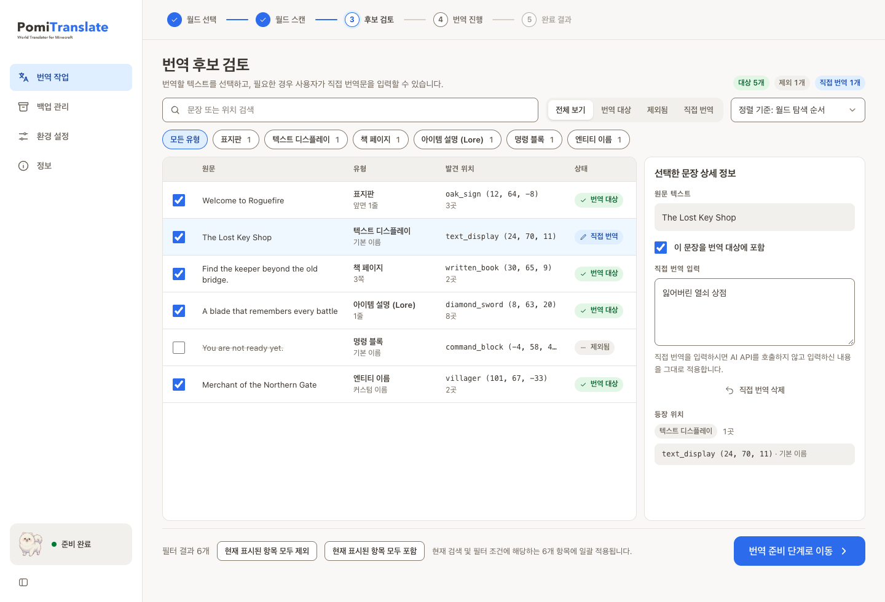
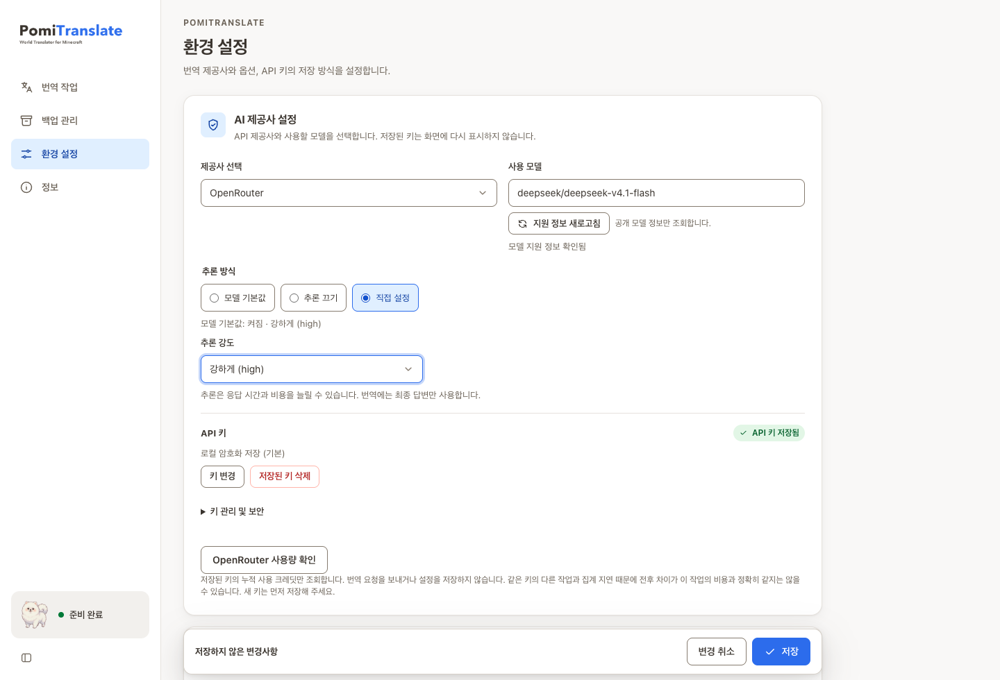

# PomiTranslate

**World Translator for Minecraft** — a desktop app for translating text in Minecraft Java Edition worlds.

[한국어](../README.md) | English | [日本語](README.ja.md) | [简体中文](README.zh.md)

PomiTranslate helps you read signs, books and item descriptions in adventure maps. Scan a world first, review the candidates, then apply your own translations or use your chosen AI provider. The mascot is Pomi.

This is a free personal open-source project started by **Hyunmin Kim (김현민)**, a university student, for his own use. It is maintained with personal time and a limited budget, rather than as a paid support service.

> **In development:** a macOS Apple Silicon development app has been exercised with isolated data. Signed releases, clean-machine Windows/Linux validation and the final paid-provider workflow remain unfinished. [Current status](current-state.md) · [Follow-up work](follow-up-work.md)
>
> NOT AN OFFICIAL MINECRAFT PRODUCT. NOT APPROVED BY OR ASSOCIATED WITH MOJANG OR MICROSOFT.

## Screenshots

The current UI was captured using **synthetic data**. Models, costs and worlds in these examples are illustrative; they are not evidence of actual usage or support. [Capture details](images/README.md)

## Features

- Scan without translating or modifying world files; inspect supported and excluded areas.
- Search and filter candidates, exclude strings, inspect occurrences and enter manual translations.
- Configure OpenAI, Gemini, Anthropic, OpenRouter, Comet or Custom endpoints. Availability depends on your provider and account.
- Choose OpenRouter reasoning defaults, disable reasoning when allowed, or select a supported effort. Model lookup does not save settings.
- Verified backups before writing, recovery snapshots before restoring, cancellation, checkpoints and result reports.
- Optional language-file translation for in-world resources.zip and explicitly selected external ZIP packs.
- Korean, English and Japanese UI; a Tauri/Svelte desktop shell and shared Python core.

## Use

1. Close Minecraft/server and make an independent **copy and backup** of the world.
2. In Settings, choose provider, model and target language. Save your own API key if using AI translation.
3. Select the copy, scan it, and read compatibility/scope warnings.
4. Review candidates, exclusions and manual translations.
5. Check the run summary, reasoning, costs and external-data notice before starting.
6. Review the result and verify it in the game. Use Backups to restore if needed.

Development builds currently require source setup. Use Python3.12, the pinned pnpm/package configuration, Rust and platform Tauri prerequisites; see [development instructions](development.md). The packaged design embeds a Python sidecar, but complete clean-machine release validation remains pending.

See the [user guide](user-guide.md) for details and CLI usage. Datapacks, scoreboard, command storage, playerdata, level.dat text and folder resource packs are outside the current translation scope. Unknown formats, Bedrock, .mcr and .linear are not writable. A passing [fixture](support-matrix.md) is not a promise for every Minecraft version or map.

## Costs, data and disclaimer

Back up your world before translating. PomiTranslate writes to the world files you select.

Text you choose to translate is sent to the API provider you select and may incur charges.

PomiTranslate has no purchase, subscription, or in-app payment. API costs, reasoning tokens, retries and provider terms are separate from the free application. Estimates are not billing limits.

Desktop credentials default to a local encrypted SQLite vault plus a separate key file. Session-only and OS-keychain modes are optional. Processes that can read both files under your account are outside that protection. CLI credential compatibility is separate. [Data and key handling](privacy.md)

Provided **AS IS**, without guarantees of translation accuracy, compatibility, data preservation or continued support. To the extent permitted by law, author/contributor liability is limited by [MIT](../LICENSE). This includes risks involving world files, downtime and API charges; it does not waive liability that cannot legally be excluded. No paid recovery, compensation or support schedule is promised. [Full disclaimer and rights notice](disclaimer.md)

MIT does not grant rights to Minecraft assets, maps, resource packs or trademarks. Obtain the original creator's permission before redistributing translated content.

## Contributor and license

- **김현민 / Hyunmin Kim** — creator/maintainer · [mini0227kim@gmail.com](mailto:mini0227kim@gmail.com)
- [Issues](https://github.com/kim0040/Minecraft-World-Translator/issues) · [Contributing](../CONTRIBUTING.md)

Project source retains MIT. Dependencies retain their own licenses; unresolved platform and bundled-notice obligations block a final binary release. [Third-party notices](../THIRD_PARTY_NOTICES.md) · [Documentation index](README.md)
