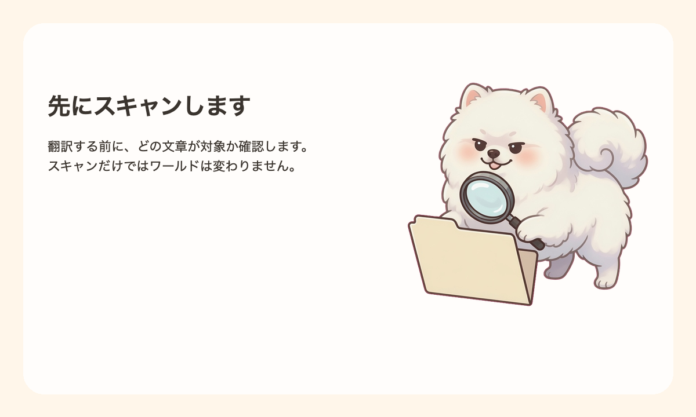
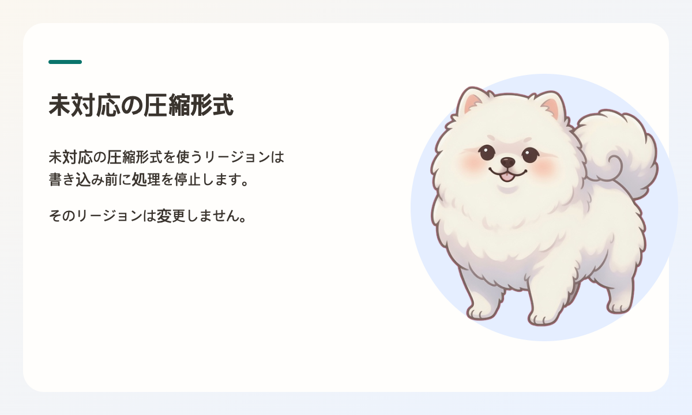
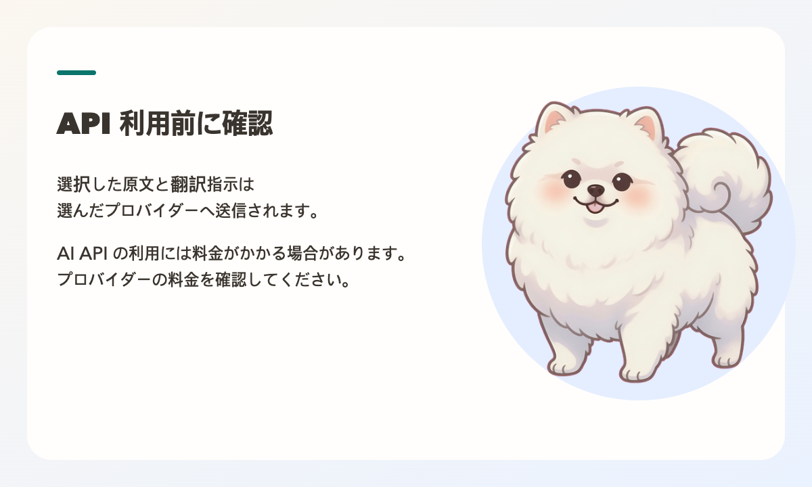
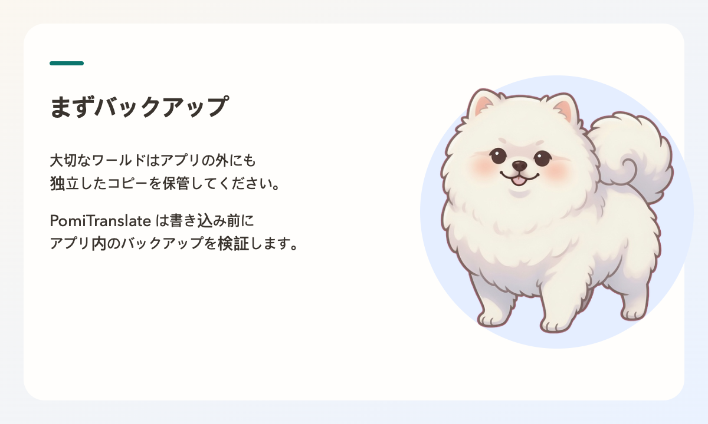

# PomiTranslate

World Translator for Minecraft

NOT AN OFFICIAL MINECRAFT PRODUCT. NOT APPROVED BY OR ASSOCIATED WITH MOJANG OR MICROSOFT.

Back up your world before translating. PomiTranslate writes to the world files you select.

Text you choose to translate is sent to the API provider you select and may incur charges.

PomiTranslate has no purchase, subscription, or in-app payment.


[English](../README.md) | [한국어](README.ko.md) | 日本語 | [简体中文](README.zh.md)

PomiTranslate は、Minecraft Java Edition のワールドデータ内からプレイヤーに表示されるテキストを抽出し、多言語へ翻訳する無料のオープンソース・ローカルユーティリティです。マスコットキャラクターは Pomi（ポミ）で、リポジトリの識別名は `Minecraft-World-Translator` です。

CLI（コマンドライン）と Tauri 製デスクトップアプリの双方が、パッケージ化された軽量な JSONL プロセス通信を介して同一のコア翻訳エンジンを使用します。翻訳処理は、事前のバックアップ整合性が確認された場合にのみ安全にワールドファイルへ反映されます。スキャン専用（Scan Only）モードでは、外部APIの呼び出しやワールドファイルの変更を一切行いません。コマンドセレクター、リソースロケーション名、座標、数値、書式コードやプレースホルダーはそのまま安全に保持されます。


## 翻訳対象テキスト

- 看板テキスト（旧バージョンの片面看板、および新バージョンの両面看板）
- 本の内容（ページ本文、本のタイトル、フィルター済みタイトル）
- エンティティ名、ブロック名、カスタム名称
- アイテムの表示名および説明文（Lore）
- 直接記述された JSON テキストコンポーネントおよび 1.20.5+ アイテムコンポーネント
- コマンド内の出力メッセージ（`tellraw`、`title`、`subtitle`、`actionbar` など）
- ワールド内蔵リソースパック（`resources.zip`）内の `lang/*.json` 言語ファイル（オプション有効時）



## 対応フォーマットと互換性

自動回帰テスト（Fixture）によって動作の安全性が検証されたフォーマットのみを公式にサポートします。

- **リージョン圧縮形式**: Gzip、Zlib、無圧縮、Minecraft 1.20.5+ LZ4 (`LZ4Block`)
- **外部チャンク**: `c.<x>.<z>.mcc` チャンクファイル（圧縮バイトデータ）
- **ディレクトリ構成**: 標準ディメンション、カスタムディメンション、`level.dat` を含む Paper/Spigot サーバーの兄弟ワールドフォルダ

### 安全のため書き込みを制限する未対応フォーマット

データ破損を防ぐため、以下の形式が検出された場合は書き込みを自動的に停止します：

- Bedrock Edition（統合版）ワールド
- Anvil 以前の旧形式 `.mcr` リージョンファイル
- サードパーティ製の `.linear` 圧縮リージョン形式
- 圧縮ID 127を含む未知または未対応の圧縮形式

詳細な対応マトリクスについては [support-matrix.md](support-matrix.md) をご確認ください。



## 対応 AI プロバイダー

公式対応プロバイダーは、OpenAI、Google Gemini、Anthropic、OpenRouter、および Custom（互換エンドポイント）です。Custom プロバイダーは、指定された Base URL に応じて OpenAI Chat 互換または Anthropic Messages 互換形式で通信します。既存の設定との後方互換性も維持されています。

本番の翻訳を開始する前に、PomiTranslate は選択されたプロバイダーのテキストモデル一覧を取得し、モデルIDやコンテキスト長を確認します。選択されたモデルが存在しない場合、ワールド保護のため書き込み前に処理を安全に中断します。

## APIキーのセキュリティと設定保存

APIキーは、設定ファイルや平文テキストではなく、OSの安全なキーチェーン（macOS Keychain、Windows Credential Manager、Linux Secret Service）に暗号化されて安全に保存されます。サービス名は `PomiTranslate` で、アカウント名には `openrouter` などのプロバイダー識別子が使用されます。キーは `settings.json`、SQLiteデータベース、ログ、Gitリポジトリには一切記録されません。

ユーザー設定は、アプリの更新時にも保持されるようインストール先ディレクトリの外側に保存されます：

- macOS: `~/Library/Application Support/PomiTranslate/settings.json`
- Windows: `%APPDATA%\PomiTranslate\settings.json`
- Linux: `$XDG_DATA_HOME/PomiTranslate/settings.json` または `~/.local/share/PomiTranslate/settings.json`

保存されたAPIキーは、デスクトップアプリの設定画面からいつでも個別に削除できます。



## クイックスタート (CLI)

CLI の推奨実行環境は Python 3.12 です。配布されているパッケージ版デスクトップアプリを使用する場合は、Python やビルドツールのインストールは一切不要です。

```bash
# 仮想環境の作成と依存関係の導入
python3 -m venv .venv
source .venv/bin/activate
python -m pip install -r requirements.txt
```

### 1. ワールドスキャン (Scan Only)
ワールドファイルを変更せず、APIリクエストも行わずに翻訳候補を抽出・確認します：

```bash
python mc_world_translator.py --world-dir "/path/to/world" --dry-run --report-path ./scan-report.json
```

### 2. 翻訳の実行
スキャンレポートを確認した上で本翻訳を実行します。スキャン時とワールドデータに差異がないことを保証するため、フィンガープリント（Fingerprint）を指定して実行します：

```bash
python mc_world_translator.py \
  --world-dir "/path/to/world" \
  --provider openrouter \
  --model "your-text-model" \
  --expect-fingerprint "<スキャンレポート内のフィンガープリント>"
```

`--api-key` を省略した場合は、OSキーチェーンに保存されている当該プロバイダーのキーが自動的に適用されます。

### 3. 安全な復元 (Restore)
問題が生じた場合、検証済みの最新バックアップ状態へいつでもワールドを復元できます：

```bash
python mc_world_translator.py --world-dir "/path/to/world" --restore-backup
```

書き込み実行時は常にバージョン管理されたバックアップセットが生成されます。復元時は変更された全ファイル（`entities` や内蔵 `resources.zip` を含む）を元に戻し、復元直前の状態もセーフティスナップショットとして保持します。Minecraft やサーバーがワールドの `session.lock` を保持している間は、安全のため書き込みを開始しません。



## デスクトップアプリ

Tauri 2 および Svelte 5 で構築されたネイティブデスクトップアプリは、以下の便利な機能と安全機構を提供します：

- **多言語UI**: 日本語、英語、韓国語の表示言語切り替えに対応（翻訳先言語と個別に設定可能）
- **最近開いたワールド管理**: 最近作業したワールドの記録とゲーム DataVersion 表示
- **互換性事前診断**: 読み取り専用形式やセッションロックを検知する構造ベースの安全性チェック
- **翻訳候補レビュー**: カテゴリ・出現頻度による並べ替え、除外指定、手動翻訳入力機能
- **事前リクエスト数・費用見積もり**: バッチサイズに基づく最小リクエスト数および推定費用の表示
- **安全な一時停止と再開**: 作業を途中で安全に停止でき、完了した翻訳文をキャッシュして未完了のテキストのみを後から再開可能
- **バックアップ履歴管理**: 過去のバックアップ一覧表示と、復元前スナップショット付きの安全な復元機能

ソースコードからのビルド手順：

```bash
pnpm install --frozen-lockfile
pnpm sidecar:build
pnpm exec tauri build
```

パッケージ化されたアプリはネイティブバイナリを含んでいるため、利用者は Python や Node.js、Rust を導入することなく利用できます。

## ローカル Web UI (レガシーツール)

Python環境が既にある場合は、軽量サーバー `webui_server.py` を起動してブラウザから利用することも可能です（`http://127.0.0.1:8765`）：

```bash
python webui_server.py
```

## 設定ファイル

設定の詳細は [config.example.toml](../config.example.toml) をご確認ください。`world_dir` は対象ワールドを指定する際に入力し、APIキーは平文ファイルに直接記述しないでください。

## テストの実行

```bash
.venv/bin/python test_core.py
.venv/bin/python tests/test_release_fixtures.py
.venv/bin/python tests/test_providers.py
.venv/bin/python tests/test_brand_secrets.py
.venv/bin/python tests/test_desktop_entry.py
```

## お問い合わせ

- バグ報告および機能要望: `mini0227kim@gmail.com`
- お問い合わせの際は、ご利用のOS、プロバイダー、モデル、エラーログを添えてご連絡ください。（セキュリティ保護のため、APIキーは絶対に送信しないでください。）

## ライセンス

本プロジェクトは [MIT License](../LICENSE) のもとで公開されているオープンソースソフトウェアです。
