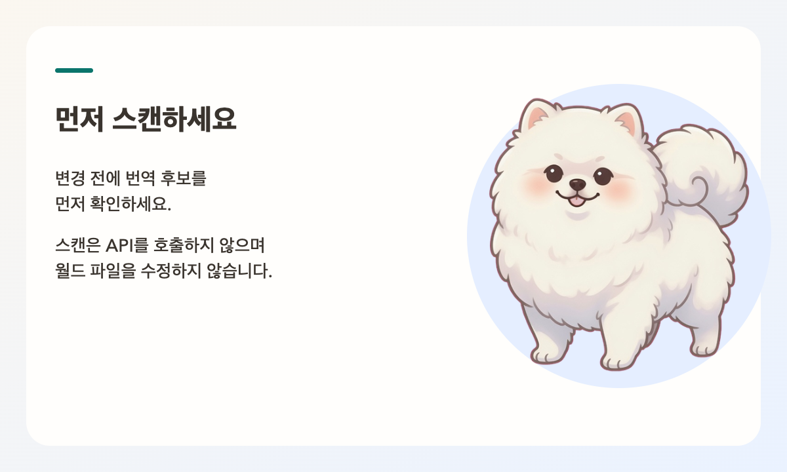
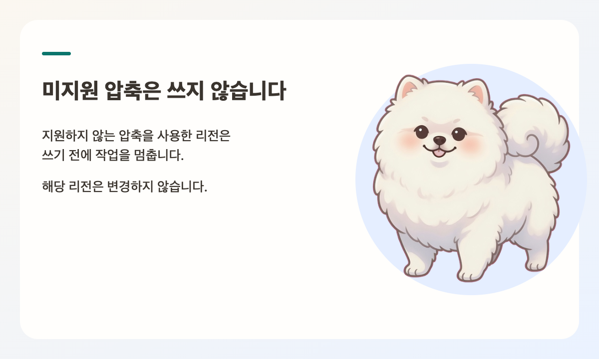
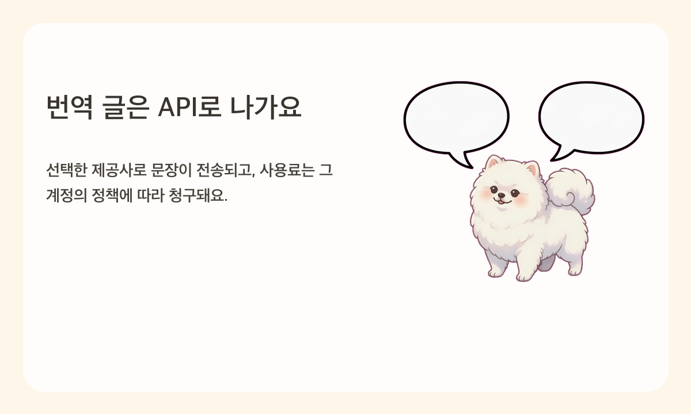

# PomiTranslate

World Translator for Minecraft

NOT AN OFFICIAL MINECRAFT PRODUCT. NOT APPROVED BY OR ASSOCIATED WITH MOJANG OR MICROSOFT.

Back up your world before translating. PomiTranslate writes to the world files you select.

Text you choose to translate is sent to the API provider you select and may incur charges.

PomiTranslate has no purchase, subscription, or in-app payment.


[English](../README.md) | 한국어 | [日本語](README.ja.md) | [简体中文](README.zh.md)

PomiTranslate는 Minecraft Java Edition 월드 내에서 플레이어에게 노출되는 텍스트를 추출하여 다양한 언어로 번역하는 무료 오픈소스 로컬 유틸리티입니다. 마스코트는 포미(Pomi)이며, 기술적 저장소 식별자 이름은 `Minecraft-World-Translator`입니다.

CLI와 Tauri 기반 데스크톱 애플리케이션 모두 동일한 고성능 Python 코어를 기반으로 동작하며, 패키징된 경량 JSONL 프로세스 통신을 사용합니다. 번역 작업은 사전 백업의 무결성이 검증된 경우에만 안전하게 월드에 반영됩니다. 스캔 전용(Scan Only) 모드는 외부 API를 일절 호출하지 않고 월드 파일도 전혀 변경하지 않습니다. 명령어 선택자, 리소스 위치 네임스페이스, 숫자, 좌표, 서식 코드 및 자리표시자는 원형 그대로 안전하게 보존됩니다.


## 번역 대상 텍스트

- 표지판 텍스트 (구버전 단면 표지판 및 신버전 양면 표지판 포함)
- 책 내용 (본문 페이지, 책 제목, 필터링된 제목)
- 커스텀 엔티티 및 블록 이름, 아이템 이름, 설명(Lore)
- 직접 입력된 JSON 텍스트 컴포넌트 및 1.20.5+ 아이템 컴포넌트
- 명령어 내 출력 텍스트 (`tellraw`, `title`, `subtitle`, `actionbar` 등)
- 월드 내장 리소스팩 (`resources.zip`) 내부의 `lang/*.json` 언어 파일 (옵션 활성화 시)



## 지원 리전 형식 및 호환성

자동화된 픽스처(Fixture) 회귀 테스트를 통과하여 안정성이 검증된 형식만 공식 지원합니다:

- **리전 압축 방식**: Gzip, Zlib, 무압축(Uncompressed), Minecraft 1.20.5+ LZ4 (`LZ4Block`)
- **외부 청크 저장소**: `c.<x>.<z>.mcc` 파일 (압축된 바이트 데이터)
- **디렉터리 구조**: 표준 월드 폴더, 커스텀 차원, `level.dat`가 포함된 Paper/Spigot 계열 서버의 형제 월드 폴더

### 감지되나 쓰기를 제한하는 미지원 형식 (데이터 안전 보호)

- Bedrock Edition 월드
- Anvil 이전의 구형 `.mcr` 리전 형식
- 타사 비표준 리전 포맷인 `.linear`
- 압축 식별자 127을 포함한 미지의 압축 형식

상세 지원 매트릭스는 [support-matrix.md](support-matrix.md)를 참고해 주세요.



## 지원 AI 제공사 (Provider)

공식 지원하는 AI 제공사는 OpenAI, Google Gemini, Anthropic, OpenRouter, 그리고 Custom(사용자 지정 엔드포인트)입니다. Custom 제공사는 사용자가 입력한 API 기본 주소(Base URL)를 바탕으로 OpenAI Chat 호환 형식 또는 Anthropic Messages 호환 규격으로 통신합니다. 기존 설정과의 하위 호환성도 충실히 지원합니다.

실제 번역을 실행하기 전, PomiTranslate는 선택된 제공사의 텍스트 모델 목록을 조회하여 공개된 모델 ID, 이름, 컨텍스트 용량을 확인합니다. 지정한 모델이 제공사 목록에서 확인되지 않을 경우 월드 파일 보호를 위해 번역 작업을 자동으로 중단합니다.

## API 키 보안 및 환경 설정

입력된 API 키는 설정 파일이나 일반 텍스트가 아닌, 운영체제 보안 키체인(macOS Keychain, Windows Credential Manager, Linux Secret Service)에 안전하게 암호화되어 저장됩니다. 서비스 이름은 `PomiTranslate`이며 계정 이름은 `openrouter`와 같은 제공사 식별자입니다. API 키는 `settings.json`, SQLite 데이터베이스, 애플리케이션 로그, Git 저장소 어디에도 기록되지 않습니다.

일반 환경 설정은 앱이 업데이트되더라도 설치 폴더 외부에 안전하게 보존됩니다:

- macOS: `~/Library/Application Support/PomiTranslate/settings.json`
- Windows: `%APPDATA%\PomiTranslate\settings.json`
- Linux: `$XDG_DATA_HOME/PomiTranslate/settings.json` 또는 `~/.local/share/PomiTranslate/settings.json`

데스크톱 환경 설정 화면에서 키체인에 보관된 API 키를 언제든 안전하게 개별 삭제할 수 있습니다.



## 빠른 시작 (CLI)

권장 실행 환경은 Python 3.12입니다. 패키징된 데스크톱 앱을 사용할 경우 사용자 환경에 Python이나 개발 도구를 별도로 설치할 필요가 없습니다.

```bash
# 가상환경 생성 및 패키지 설치
python3 -m venv .venv
source .venv/bin/activate
python -m pip install -r requirements.txt
```

### 1단계: 월드 스캔 (Scan Only)
월드를 스캔하여 번역 대상 문장과 통계를 추출합니다. 외부 API를 호출하지 않으며 월드 파일도 전혀 수정하지 않습니다:

```bash
python mc_world_translator.py --world-dir "/path/to/world" --dry-run --report-path ./scan-report.json
```

### 2단계: 번역 실행
스캔 리포트를 검토한 후 실제 번역을 실행합니다. 스캔 시점과 현재 월드 데이터의 불일치를 감지하기 위해 스캔 지문(Fingerprint)을 전달하여 안전하게 진행합니다:

```bash
python mc_world_translator.py \
  --world-dir "/path/to/world" \
  --provider openrouter \
  --model "your-text-model" \
  --expect-fingerprint "<스캔 리포트에 기재된 fingerprint>"
```

`--api-key`를 생략하면 키체인에 이미 저장된 해당 제공사의 API 키를 자동으로 사용합니다.

### 3단계: 안전 복원 (Restore)
문제가 발생할 경우 언제든 검증된 최신 백업 상태로 월드를 복원할 수 있습니다:

```bash
python mc_world_translator.py --world-dir "/path/to/world" --restore-backup
```

모든 쓰기 작업은 실행 직전 버전별 백업 세트를 생성합니다. 복원 시 변경된 모든 파일(`entities`, 내장 `resources.zip` 등 포함)을 원본 상태로 완벽히 되돌리며, 복원 직전의 상태 또한 안전 스냅샷(Recovery snapshot)으로 추가 보존합니다. Minecraft 게임이나 서버가 월드의 `session.lock`을 점유하고 있을 때는 충돌 방지를 위해 쓰기 작업을 자동으로 거부합니다.


## 데스크톱 애플리케이션

Tauri 2 및 Svelte 5로 제작된 네이티브 데스크톱 앱은 다음과 같은 편의 기능과 안전 장치를 제공합니다:

- **다국어 인터페이스 지원**: 한국어, 영어, 일본어 화면 표시 언어 완벽 지원 (번역 도착 언어와 독립적 동작)
- **최근 작업 월드 관리**: 최근 번역한 월드 목록 관리 및 DataVersion 표시
- **사전 무결성 검증**: 구조 기반 월드 호환성 자동 진단 및 쓰기 차단 감지
- **스캔 및 후보 검토**: 번역 대상 텍스트 검색, 유형별·빈도별 정렬, 번역 제외 설정, 사용자 직접 번역(Manual Override) 지원
- **비용 및 요청 수 사전 추정**: 배치 크기에 따른 최소 API 요청 수 및 예상 토큰/비용 미리보기
- **안전한 취소 및 스마트 재개**: 작업 취소 시 이미 번역된 문장을 캐시에 보존하고, 월드 지문과 설정이 일치할 때 남은 문장만 이어서 번역
- **다단계 백업 관리**: 번역 전 자동 백업 기록 조회 및 복원 전 스냅샷 보존 복원 지원

자체 빌드 방법:

```bash
pnpm install --frozen-lockfile
pnpm sidecar:build
pnpm exec tauri build
```

빌드가 완료된 바이너리는 최종 사용자가 Python, Node.js, Rust 등의 개발 런타임을 설치하지 않아도 바로 실행할 수 있습니다.

## 로컬 Web UI (보조 도구)

Python 환경이 갖추어진 경우 경량 웹 서버인 `webui_server.py`를 사용할 수 있습니다. 기본적으로 `http://127.0.0.1:8765`에서 실행됩니다 (패키징된 데스크톱 앱 사용 시에는 불필요합니다):

```bash
python webui_server.py
```

## 구성 설정 파일

세부 설정은 [config.example.toml](../config.example.toml) 파일을 참고하여 구성할 수 있습니다. `world_dir`은 실제 대상 월드를 지정할 때만 입력하며, API 키는 파일 내에 평문으로 기재하지 마세요.

## 검증 및 테스트

```bash
.venv/bin/python test_core.py
.venv/bin/python tests/test_release_fixtures.py
.venv/bin/python tests/test_providers.py
.venv/bin/python tests/test_brand_secrets.py
.venv/bin/python tests/test_desktop_entry.py
```

## 문의 및 지원

- 버그 제보 및 기능 제안: `mini0227kim@gmail.com`
- 문의 시 사용 중인 운영체제, AI 제공사 및 모델, 문제 상황 로그를 함께 첨부해 주시면 빠른 확인이 가능합니다. (보안을 위해 API 키는 절대 첨부하지 마세요.)

## 라이선스

본 프로젝트는 [MIT License](../LICENSE)에 따라 자유롭게 사용할 수 있는 오픈소스 소프트웨어입니다.
