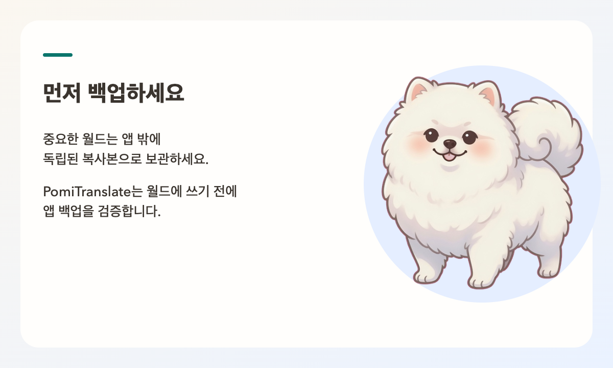

# PomiTranslate

World Translator for Minecraft (마인크래프트 월드 번역기)

NOT AN OFFICIAL MINECRAFT PRODUCT. NOT APPROVED BY OR ASSOCIATED WITH MOJANG OR MICROSOFT.
(공식 마인크래프트 제품이 아니며, Mojang 또는 Microsoft의 승인을 받거나 관련되어 있지 않습니다.)

월드를 번역하기 전에 반드시 백업하세요. PomiTranslate는 사용자가 지정한 월드 파일에 직접 번역 텍스트를 기록합니다.

번역 대상으로 선택한 텍스트는 사용자가 설정한 AI 제공자의 API로 전송되며, 이용 요금이 발생할 수 있습니다.

PomiTranslate에는 유료 결제, 정기 구독, 인앱 결제가 전혀 없습니다.


[English](../README.md) | 한국어 | [日本語](README.ja.md) | [简体中文](README.zh.md)

PomiTranslate는 마인크래프트 자바 에디션(Java Edition) 월드 내에 존재하는 모든 플레이어 노출 텍스트를 안전하게 추출하고 번역하는 무료 오픈소스 로컬 도구입니다. 프로젝트의 마스코트는 Pomi이며, 저장소 식별자는 `Minecraft-World-Translator`를 유지합니다.

해외 어드벤처 맵, 커스텀 스토리 RPG, 탈출 맵, 대규모 서버 월드를 플레이할 때 언어 장벽 없이 자연스럽게 몰입할 수 있도록 돕습니다. CLI와 네이티브 데스크톱 앱(Tauri) 모두 동일한 고성능 Python 번역 코어를 패키징된 경량 JSONL 프로세스로 실행하며, 외부 통신용 localhost 포트를 일절 개방하지 않습니다.


---

## 핵심 설계 원칙 및 안전 보장

마인크래프트 월드는 수천 개의 청크와 리전 파일에 복잡한 NBT(Named Binary Tag) 트리 구조로 저장됩니다. 단순 정규식 치환이나 불안정한 NBT 인코더를 사용하면 좌표 헤더가 깨지거나 명령 블록 로직이 영구적으로 파손될 위험이 있습니다. PomiTranslate는 데이터 무결성을 위해 다음과 같은 원칙을 엄격히 준수합니다.

- **바이트 단위 NBT 무결성 보존**: 수정되지 않은 청크는 SHA-256 해시까지 원본과 완전히 동일하게 보존됩니다. 텍스트가 번역될 때도 주변 태그를 재직렬화하지 않고 수정된 Java Modified UTF-8 문자열 페이로드만 정밀하게 제자리 교체(in-place update)합니다.
- **게임 서식 기호 및 구문 완벽 보호**: 마인크래프트 색상/서식 기호(`§a`, `§l`, `§r`), 줄바꿈(`\n`), 자리표시자(`%s`, `{0}`), JSON 텍스트 컴포넌트 구조, 명령 블록 대상 선택자(`@a`, `@p`)를 보존 엔진이 철저히 감시합니다. AI 응답에서 기호가 훼손된 경우 원문을 유지하여 월드 렌더링 오류를 사전에 차단합니다.
- **Scan-First (스캔 우선) 구조**: Scan Only 모드는 월드 내 텍스트를 추출하고 중복을 제거한 뒤 스캔 계획(Scan Plan)을 생성합니다. 이 과정에서는 외부 API를 전혀 호출하지 않으며 월드 파일도 일체 변경하지 않습니다.
- **Java session.lock 활성 잠금 감지**: 번역 기록 전 월드 폴더의 `session.lock`을 반드시 확인합니다. 마인크래프트 클라이언트나 서버가 월드를 실행 중인 경우 쓰기 작업을 즉시 중단합니다.
- **버전별 원자적 백업 및 복원**: 파일이 수정되기 직전에 OS 앱 데이터 디렉터리에 검증된 다중 파일 백업 세트를 자동 생성합니다. 번역 중 네트워크 장애가 발생해도 부분 쓰기를 방지하며, 복원 직전 상태까지 안전하게 보존합니다.


---

## 지원하는 인게임 텍스트 컴포넌트

오버월드, 네더(`DIM-1`), 엔드(`DIM1`) 및 커스텀 데이터팩 차원까지 전체 월드를 탐색하여 다음 텍스트 요소를 안전하게 추출합니다.

| 컴포넌트 구분 | 대상 인게임 요소 | 추출 및 처리 방식 |
| :--- | :--- | :--- |
| **표지판 (Signs)** | 일반 표지판, 매다는 표지판 | 1.8~1.19 버전의 레거시 단면 표지판 라인과 1.20+ 최신 양면 표지판(앞면 및 뒷면 `messages`) 완벽 지원 |
| **책 (Books)** | 책과 깃펜, 완성된 책 | 책 제목, 필터링된 제목, 저자 정보, 일반 텍스트 및 JSON 컴포넌트로 구성된 개별 페이지 번역 |
| **아이템 메타데이터** | 무기, 도구, 방어구, 커스텀 아이템 | 아이템 표시 이름(`display.Name`), 설명(Lore), 1.20.5+ 최신 아이템 컴포넌트(`minecraft:custom_name`, `minecraft:lore`), 호버 및 클릭 이벤트 텍스트 |
| **보관함 (Containers)** | 상자, 셜커 상자, 통, 화로 등 | 보관함의 커스텀 이름 및 내부 슬롯에 들어 있는 모든 중첩 아이템을 재귀적으로 스캔 |
| **엔티티 및 블록** | 몹, NPC, 갑옷 거치대, 커스텀 블록 | 생명체 엔티티의 이름표(`CustomName`), 아머스탠드 텍스트, 네임드 타일 엔티티 이름 |
| **디스플레이 엔티티** | 텍스트 디스플레이 (`text_display`) | 1.19.4+ 버전에 추가된 텍스트 디스플레이 엔티티의 컴포넌트 텍스트 지원 |
| **명령 블록 (Command Blocks)** | 반응형, 반복형, 연쇄형 명령 블록 | `/tellraw`, `/title`, `/subtitle`, `/actionbar` 명령과 `execute ... run`으로 중첩된 하위 명령 내의 텍스트를 추출하며, 좌표나 대상 선택자는 원형 그대로 보존 |
| **월드 리소스팩** | 월드 내 `resources.zip` | 활성화 시 월드 내부 리소스팩 언어 파일(`assets/<namespace>/lang/*.json` 또는 `.lang`)을 함께 스캔 및 번역하며 리전 파일과 동일 백업 세트로 관리 |

---

## 리전 파일 및 형식 호환성

회귀 픽스처 검증을 거친 형식만 공식적으로 쓰기를 허용합니다.

### 공식 지원 형식
- **리전 파일 표준**: 마인크래프트 자바 에디션 Anvil 형식(`.mca`) 및 엔티티 저장소 폴더(`entities/*.mca`)
- **청크 압축 알고리즘**: Gzip, Zlib, 무압축(Uncompressed), 마인크래프트 1.20.5+ LZ4 (`LZ4Block`)
- **외부 오버플로우 청크**: 대규모 청크 데이터용 외부 `.mcc` 파일(`c.<x>.<z>.mcc`)
- **디렉터리 구조**: 일반 바닐라 단일 월드, 커스텀 데이터팩 차원 폴더, `level.dat`를 공유하는 Paper/Spigot 멀티월드 분리 폴더 구조

### 지원하지 않는 형식 (감지 시 자동 쓰기 잠금)
월드 데이터 손상을 방지하기 위해 다음 형식이 감지되면 즉시 쓰기를 차단하고 읽기 전용 상태를 유지합니다.
- **베드락 에디션 (Bedrock)**: Bedrock 구조의 레벨 또는 Mojang LevelDB(`.ldb`) 파일
- **Anvil 이전 구버전 포맷**: 1.2 이전 레거시 `.mcr` 리전 파일
- **서드파티 압축 포맷**: 사설 서버에서 쓰이는 Zstandard 기반 `.linear` 리전 파일
- **미확인/손상된 압축 포맷**: 식별되지 않는 압축 헤더(압축 타입 127 등)

상세 검증 목록은 [support-matrix.md](support-matrix.md)에서 확인하실 수 있습니다.


---

## 지원 인공지능 제공자 및 키체인 보안

PomiTranslate는 다양한 최신 AI 엔진을 공식 지원합니다.
- **OpenAI**: GPT-4o, GPT-4o-mini 및 호환 챗 모델
- **Anthropic**: Claude 3.5 Sonnet, Claude 3.5 Haiku, Claude 3 Opus
- **Google Gemini**: Gemini 1.5 Pro, Gemini 1.5 Flash, Gemini 2.0 Flash
- **OpenRouter**: 수백 종의 상용 및 오픈소스 LLM 라우팅 지원
- **Custom (호환 및 로컬 LLM)**: Ollama, vLLM, LM Studio 등 표준 OpenAI Chat 또는 Anthropic Messages 규격을 따르는 로컬/사설 추론 엔드포인트 연동 지원

번역 시작 전 제공사의 활성 모델 목록(Catalog)을 조회하여 모델 존재 여부와 컨텍스트 길이를 사전 검증합니다. 카탈로그에 없는 모델은 월드 쓰기 전 안전하게 중단됩니다.

### 운영체제 키체인 기반 보안
API 키는 일반 텍스트, `settings.json`, SQLite 데이터베이스, 애플리케이션 로그, 깃 커밋 등에 절대 노출되지 않습니다.
- **macOS**: Apple Keychain Services (`PomiTranslate`)
- **Windows**: Windows 자격 증명 관리자 (`PomiTranslate`)
- **Linux**: Freedesktop Secret Service (DBus)

저장된 API 키는 번역 배치 실행 시 프로세스 표준 입력(stdin)을 통해서만 메모리로 안전하게 전달되며, 설정 화면에서 언제든지 개별 삭제할 수 있습니다.

사용자 설정 저장 경로:
- macOS: `~/Library/Application Support/PomiTranslate/settings.json`
- Windows: `%APPDATA%\PomiTranslate\settings.json`
- Linux: `$XDG_DATA_HOME/PomiTranslate/settings.json` (또는 `~/.local/share/PomiTranslate/settings.json`)


---

## 3단계 번역 작업 흐름

```
[1단계: Scan Only (스캔 우선 검토)]
월드 파일 (.mca) ──> 텍스트 추출 ──> 중복 제거 ──> 스캔 계획 & 월드 지문 생성
(API 호출 0회, 순수 읽기 전용, 후보 검색·필터·제외 및 직접 번역 기능 지원)

[2단계: Batched Translation (일괄 배치 번역)]
고유 후보군 ──> 속도 제한 & 서킷 브레이커 ──> AI 제공자 호출 ──> 검증된 체크포인트 저장
(서식 기호 보존 검사, 네트워크 장애 시 안전 중단, 부분 실패 시 재개 지원)

[3단계: Atomic Write (원자적 월드 쓰기)]
다중 파일 백업 생성 ──> session.lock 잠금 확인 ──> 리전 패치 기록 ──> 완료
(바이트 단위 NBT 패치, 복원 직전 복구 스냅샷 보존, 원클릭 롤백 지원)
```

---

## 빠른 시작 (CLI)

CLI 사용 시 Python 3.12 환경을 권장합니다. (패키징된 데스크톱 앱 사용자는 Python이나 빌드 도구를 설치할 필요가 없습니다.)

```bash
# 가상환경 구성
python3 -m venv .venv
source .venv/bin/activate
python -m pip install -r requirements.txt
```

### 1. Scan Only (API 호출 없이 안전하게 후보 추출)
```bash
python mc_world_translator.py \
  --world-dir "/path/to/minecraft/saves/MyWorld" \
  --dry-run \
  --report-path ./scan-report.json
```

### 2. 월드 번역 실행 (스캔 지문 기반 안전 실행)
```bash
python mc_world_translator.py \
  --world-dir "/path/to/minecraft/saves/MyWorld" \
  --target-language "ko" \
  --provider openrouter \
  --model "anthropic/claude-3.5-sonnet" \
  --style story \
  --expect-fingerprint "<스캔 리포트에서 확인한 지문>"
```
*`--api-key`를 생략하면 OS 키체인에 저장된 키를 자동으로 사용합니다.*

### 3. 백업에서 월드 복원
```bash
python mc_world_translator.py \
  --world-dir "/path/to/minecraft/saves/MyWorld" \
  --restore-backup
```



---

## 네이티브 데스크톱 애플리케이션

Tauri 2와 Svelte 5로 제작된 데스크톱 앱은 직관적이고 쾌적한 GUI 환경을 제공합니다.

- **다국어 UI 즉각 전환**: 번역 대상 언어와 독립적으로 한국어, 영어, 일본어 인터페이스를 실시간으로 전환할 수 있습니다.
- **후보 검토 및 필터링 테이블**: 추출된 텍스트의 발생 횟수, 좌표, 블록/엔티티 ID를 확인하고 특정 텍스트를 번역에서 제외하거나 직접 수정할 수 있습니다.
- **요청 횟수 및 비용 추정**: API 호출 전 전역 배치 크기 기반 최소 요청 수와 토큰 정보를 투명하게 미리 확인합니다.
- **안전한 취소 및 이어하기**: 작업 취소 시 월드 손상 없이 안전하게 멈추며, 체크포인트를 활용해 미번역 텍스트만 이어서 진행합니다.
- **백업 관리 및 롤백**: 월드별 백업 히스토리를 확인하고 원하는 시점으로 언제든 되돌릴 수 있습니다.

### 소스코드에서 데스크톱 앱 빌드
```bash
pnpm install --frozen-lockfile
pnpm sidecar:build
pnpm exec tauri build
```

---

## 번역 스타일 프리셋

맵의 장르와 분위기에 맞추어 6가지 현지화 스타일을 선택할 수 있습니다.
- **기본 (`neutral`)**: 군더더기 없이 정확하고 정돈된 기본 스타일 (야생/서바이벌 및 시스템 맵 권장)
- **자연스러운 대화체 (`casual`)**: 인게임 NPC 대화와 모험의 생동감을 살리는 친근한 구어체 스타일
- **격식체 (`formal`)**: 비석, 일지, 역사 기록물에 어울리는 절제되고 단정한 문체
- **정중한 존댓말 (`polite`)**: 튜토리얼, 가이드 안내문, 퀘스트 설명에 적합한 다정한 안내 문체
- **스토리 소설풍 (`story`)**: 판타지 및 어드벤처 맵의 몰입감을 극대화하는 서사적이고 풍부한 문학적 표현
- **사용자 정의 (`custom`)**: 특수 모드팩 세계관이나 고유 설정을 반영할 수 있는 맞춤 지침 프롬프트

---

## 자동화 테스트 실행

```bash
# 코어 단위 테스트
.venv/bin/python test_core.py

# 릴리스 픽스처 검증 (압축, NBT, 세션 잠금, 복원 무결성)
.venv/bin/python tests/test_release_fixtures.py

# 제공자 API 및 키체인 설정 테스트
.venv/bin/python tests/test_providers.py

# 브랜드 표기 및 비밀 노출 방지 검증
.venv/bin/python tests/test_brand_secrets.py

# 데스크톱 사이드카 프로토콜 테스트
.venv/bin/python tests/test_desktop_entry.py

# 프론트엔드 유닛 테스트
./node_modules/.bin/vitest run
```

---

## 문의 및 피드백

- 버그 제보 및 기능 제안: `mini0227kim@gmail.com`
- 문의 시 운영체제 종류, AI 제공자 및 모델명, 관련 오류 로그를 함께 남겨주시면 빠른 확인이 가능합니다. (개인 API 키는 절대 첨부하지 마세요.)

---

## 라이선스

PomiTranslate는 [MIT 라이선스](../LICENSE)에 따라 배포됩니다.
