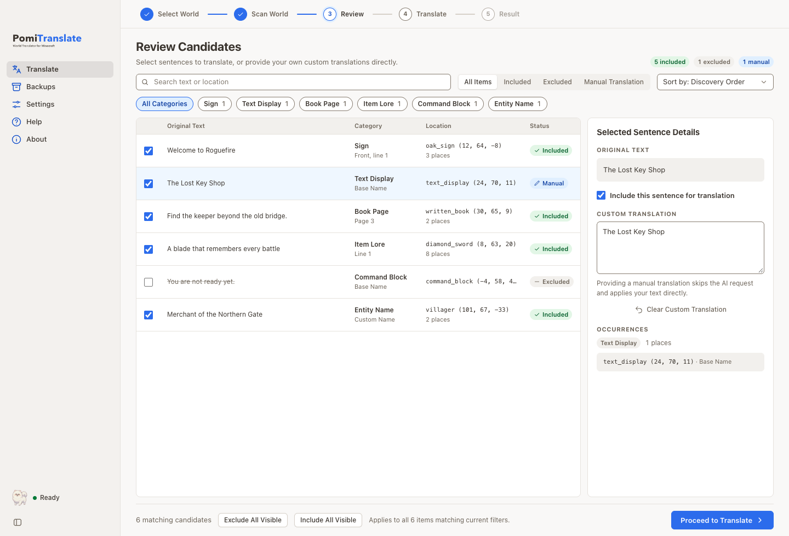
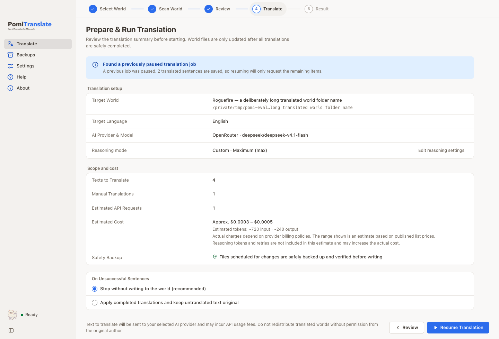

# PomiTranslate user guide

English | [한국어](user-guide.md) | [日本語](user-guide.ja.md) | [简体中文](user-guide.zh.md)

## Before you start


The app is in development. Main workflows have been exercised in a macOS Apple Silicon development app; signed distribution and full OS validation remain unfinished. Read the [development guide (Korean)](development.md) and [support matrix (Korean)](support-matrix.md).

Close Minecraft or the server and make an **independent copy of your world**. Automatic backups do not replace your own backup. The original creators retain their rights to maps and resource packs; the software's MIT license does not grant permission to redistribute them.

## 1. Settings

### Provider, model and key


- **Provider:** choose OpenAI, Gemini, Anthropic, OpenRouter, Comet or Custom endpoint. Custom requires an endpoint URL and an OpenAI/Anthropic-compatible wire format.
- **Model:** enter a model ID or choose from the list. When known, input and output prices are shown per million tokens.
- **Refresh support information:** OpenRouter's public catalog loads automatically and can be refreshed manually. This lookup does not save settings or send keys or world text. Other providers may require a saved key. Cached information, lookup failures and missing models are distinguished in the UI.
- **API key:** save your own key for AI translation. Saved keys are represented by their storage status and mode, never their original value. You can change or delete them.
- **Reasoning (OpenRouter and Gemini):** choose Model default, Disable reasoning or Custom. Verified model information restricts the available effort levels; mandatory reasoning cannot be disabled. For Gemini, refresh support information using a saved key to check thinking support. Gemini 3 models enable thinking by default and can consume many billed output tokens even for short translations. Disable reasoning for translation where possible. Some models cannot turn it off completely; the app adjusts to the lowest accepted level. Thinking tokens are included in reported output usage.
- **Check OpenRouter usage:** retrieves cumulative credits used by the saved key without translating or saving settings. Other jobs using that key and reporting delays can affect the before/after difference. It may differ from this job's cost.

### Language and tone

- **Target Language:** enter the language of the translated text, such as English, 한국어, 日本語 or 简体中文. This is independent of the three UI languages (Korean, English and Japanese); it is not limited to them.
- **Tone:** choose neutral/natural, casual/conversational, formal/clear, polite, story, or a custom system prompt.
- **Extra instructions:** add rules such as “Keep proper names in the original language.”
- **Improve instructions:** expands a short note with AI. It sends a separate request to the chosen provider and may cost money; confirm before running it.

### Scan scope

- Choose signs, book pages, book titles, filtered book titles, entity/block names, item names/lore, text displays and command text components. Recommended and story presets, select/clear all and exclusion of command-like plain strings are available.
- Skip text already written in the target language to reduce repeated translation.
- Set additional region directories, excluded file patterns and translation-key prefixes.
- Optionally translate the in-world `resources.zip` and up to 16 explicitly selected external ZIPs. A scope change requires another scan.

### Speed and request limits

Configure concurrency, sentences per batch, requests per minute (RPM), tokens per minute (TPM), request timeout, maximum retries and Temperature. A zero rate limit adds no separate throttling. Configure safe file-write retries and whether other files should continue after a file error; continuing can produce a partial result.

### Advanced settings and saving

- **Saved manual translations:** register exact source-to-translation pairs as JSON for every world. No API is called, and translations entered in Review take priority. Limits: 5,000 pairs, 32,000 characters each, 1 MB total.
- **Import/export:** import PomiTranslate or legacy Web UI JSON, or public string constants from `translate.py`. Python files are never executed. Keys, world paths, UI language and external ZIP paths are omitted.
- **Save bar:** the pinned bottom bar shows whether changes are saved. Save or discard the draft. Public settings exports do not contain keys.

### Interface and app information

- **Display Language:** Korean, English or Japanese. Changing the UI language does not choose the translation language. Chinese documentation is available; Chinese UI is not implemented.
- **Appearance:** choose System, Light or Dark in Settings or the View menu. The selection applies immediately and is stored without pressing Save. System follows OS appearance changes. Startup background handling is implemented; current macOS/Windows native appearance checks remain pending.
- **Zoom:** View offers 75–200%. `Cmd/Ctrl+0` resets to 100%; `Cmd/Ctrl+2` selects 200%.
- **Menus and shortcuts:** `Cmd/Ctrl+O` opens a world, `Cmd+,` opens Settings on macOS, and `Cmd/Ctrl+F` focuses Review search. Help includes the guide, getting started, shortcuts, licenses and issue reporting. Update checks appear in the macOS app menu or the Help menu elsewhere. Web links open in the default browser.
- **Window:** long jobs report progress in the Dock/taskbar and request attention when finished in the background. Closing or quitting is blocked during an active job with an explanation. Latest native behavior is still subject to the pending OS checks.
- **About:** app version, supported/unsupported formats, diagnostics, repository/license/contact links and the original Minecraft non-affiliation notice. Open-source licenses are viewable here or from Help.
- **Help/getting started:** open Help from the sidebar, `F1`, or macOS `Cmd+?`. It includes quick start, FAQs, shortcuts and provider key pages. A four-step introduction appears after accepting the first-launch notice and can be reopened from Help.
- **Updates:** check in Settings. Optional daily automatic checks fetch only GitHub version metadata. Builds containing a signature-verification key can install and restart; other builds open the download page. Installation is blocked during scan, translation and restore. Settings, saved keys and backups are intended to persist. Signed updates are not yet release-validated.
- **Data location:** Settings displays and opens the settings/jobs/backups and encrypted-key directories. Updates and cache cleanup must not delete these directories. See [updates and data preservation (Korean)](updates-and-data.md).
- **Reset:** two confirmations clear settings, recent worlds, resumable jobs, model catalogs and optionally saved API keys, then restart the app. **World backups and original worlds are retained.**

## 2. Select a world and scan


Select a copied world folder containing `level.dat` or a server root. Open a folder, drop a folder/`level.dat` onto the window, or choose a discovered Minecraft world. Discovery reads launcher saves folders, including Prism/MultiMC on macOS/Linux and CurseForge on Windows, without modifying them. The app reads the selected folder directly rather than copying it. Check dimensions, DataVersion, embedded resource packs and stored backups.

Bedrock, legacy `.mcr`, `.linear`, worlds in use, inaccessible folders and paths pointing outside the selected world are blocked before starting.

Scan collects candidates **without translation API requests or world writes**. Distinguish unique strings from total occurrences and read the scope and exclusions. Unreadable chunks are preserved and reported. A readable fixture is not proof of complete version/mod support. `tellraw`/`title` JSON and Java 1.21.5+ SNBT components are parsed; only changed strings are rewritten in their original quoting. Unparsed commands are preserved with a warning. Export the latest scan report as JSON when needed.

## 3. Review candidates

Search text/locations, sort by world order/source/frequency/kind, and filter by kind or state. Select a row to inspect its source and occurrences and enter a manual translation. Uncheck it to exclude it; bulk inclusion/exclusion applies to the current filter.

Keep `§` formatting codes and placeholders such as `%s` and `{0}`. If required tokens are missing or extra tokens appear, the source is retained and the result reports formatting protection. Moving a token while preserving its count is allowed.

One candidate applies the same translation to all occurrences of that source. Per-occurrence translation, a glossary and translation memory remain follow-up work. An entirely manual run needs no translation API request.



## 4. Run and result

In Run, check the world, target language, provider/model, strings to send, manual overrides, reasoning, estimated requests/cost and external-transfer notice. Writing starts only after translation succeeds and the backup is verified. Estimates can omit reasoning tokens, retries and routing-price differences; check your provider's dashboard.



| State | Meaning |
| --- | --- |
| Completed | All translations were applied. |
| Partial | Untranslated strings were retained. |
| Retry needed | World files are unchanged; completed translations are saved so only remaining strings need another request. |
| Failed | Check changed-file counts and errors; restore if needed. |
| Cancelled | Completed translations are saved for resuming. |
| World in use | Close the game/server and try again. |
| World changed | Writes stopped because files changed after the scan. Scan again. |
| Unsupported | World files are unchanged. |

The result reports prepared/applied/retained/failed/protected strings, changed files, requests, tokens and reported cost, with examples and failure details. Check translations and commands **in game**. Exported reports may contain world paths, source text and translations; inspect them before sharing.

## 5. Restore

With Minecraft and the server closed, open Backups. Verify the world and restore point, read the confirmation and restore. A recovery snapshot saves the state immediately before restore. Restoring can undo edits and game progress made since that backup.

Backups may live in app data or a legacy in-world directory; their verification status is shown. If external ZIPs were translated, select the same ZIPs again in Settings before restoring.

Desktop manages backup/checkpoint locations and provides no backup-off, suffix or arbitrary-path options. Newly created large-chunk files can be removed to restore the previous file layout after taking a recovery snapshot. Restore these new backups with the latest app. Legacy backups remain discoverable/restorable.

Do not ignore verification, path or corruption warnings. Backups cannot guarantee recovery from every storage failure or external modification.

## CLI

The CLI shares the Python core but uses its existing OS keyring/environment compatibility, independently of the desktop vault. Do not put secrets in command arguments, plain settings or Git; use the OS keyring. Desktop keys are not shared automatically.

```bash
# Store reports outside the world.
.venv/bin/python mc_world_translator.py \
  --world-dir "/path/to/World-copy" \
  --dry-run \
  --report-path "/tmp/pomi-scan-report.json"

.venv/bin/python mc_world_translator.py --help
```

| Option | Purpose |
| --- | --- |
| `--dry-run` | Scan without API calls or world writes. |
| `--expect-fingerprint` | Refuse writing if the world differs from the scan fingerprint. |
| `--resume` | Continue remaining translations from a checkpoint. |
| `--restore-backup` | Restore the latest verified backup. |
| `--no-backup` | Run without a backup; discouraged. |
| `--resource-pack-zip` | ZIP path; repeat for multiple packs. |
| `--enable-resource-pack-translation` / `--disable-resource-pack-translation` | Override ZIP translation settings. |
| `--list-models` | List provider models and exit. |
| `--enhance-style-brief` | Expand instructions with AI; may cost money. |
| `--print-notices` | Print first-launch safety information. |
| `--provider`, `--model`, `--base-url`, `--wire-format`, `--api-key` | Provider, model, endpoint, format and key options. |
| `--target-language`, `--style-preset`, `--style-prompt`, `--custom-system-prompt` | Translation language and tone. |
| `--batch-size`, `--temperature` | Request batch size and variation. |
| `--config`, `--data-dir`, `--report-path` | Config, app data and report paths. |

These examples use macOS/Linux. Windows uses `.venv\Scripts\python.exe`. Actual translation can modify files and incur API charges.

## Troubleshooting


| Symptom | Action |
| --- | --- |
| App could not get ready | Startup stops after 30 seconds for core handshake or 60 seconds for initial world/backup data. Retry, restart and check the recent world's drive. These limits do not apply to long running translations/restores. |
| `AUTH_FAILED` | Check your API key in Settings. |
| `NO_CREDIT` | Check provider credit/balance. |
| `RATE_LIMITED` | Wait or lower concurrency. |
| `MODEL_NOT_FOUND` | Check the model ID or refresh support information. Old Gemini `flash`/`pro` aliases become `gemini-flash-latest`/`gemini-pro-latest`. |
| Slow Gemini response / output token limit | Disable thinking where possible or choose a flash-lite model. |
| `NETWORK_ERROR` | Check connectivity and provider status. |
| World in use | Fully close Minecraft/server. |
| Stale scan | Scan again after world/scope changes. |
| Saved-key status unavailable | Re-enter or delete and save the key again. |

Report OS, version and reproduction steps without secrets in [Issues](https://github.com/kim0040/PomiTranslate/issues). [Disclaimer](disclaimer.en.md) · [Privacy](privacy.en.md)
