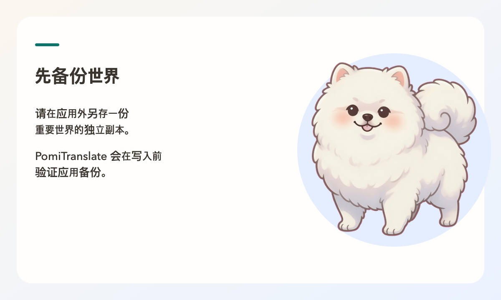
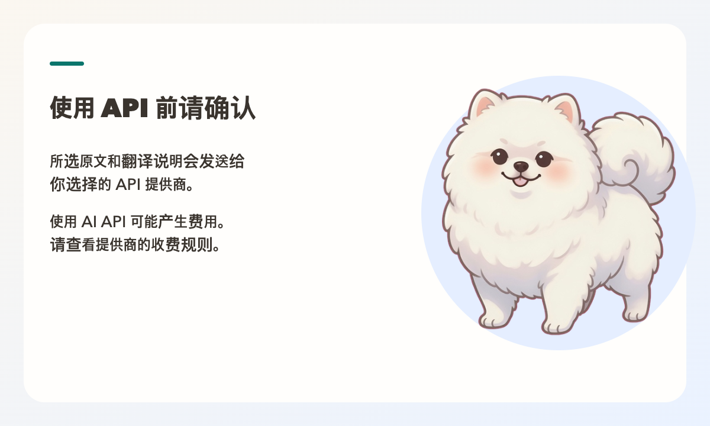
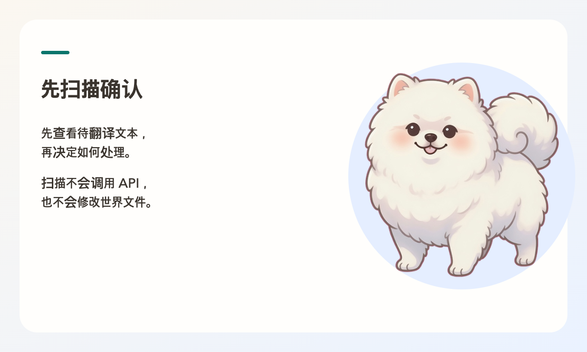
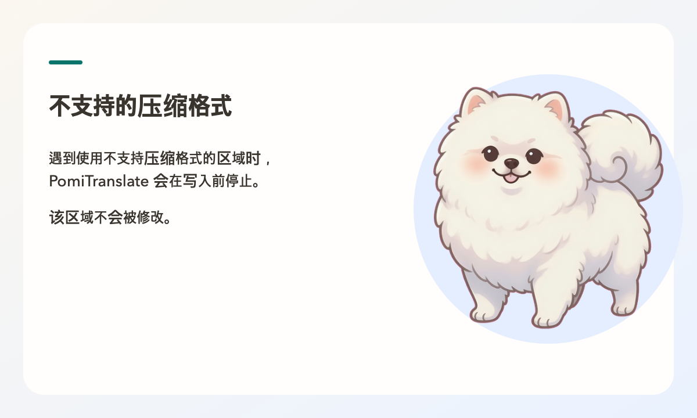

# PomiTranslate 使用指南

[English](user-guide.en.md) | [한국어](user-guide.md) | [日本語](user-guide.ja.md) | [简体中文](user-guide.zh.md)

> **关于语言：** PomiTranslate 当前的应用界面支持韩语、英语和日语，尚未提供中文 UI。本指南是中文翻译，截图和实际界面文字可能仍显示为 English。**界面语言**与**翻译目标语言**是两个独立设置；即使使用英文界面，也可以把世界文本翻译成中文或其他你输入的语言。

## 开始前



应用目前仍在开发中。主要流程已在 macOS Apple Silicon 开发应用中确认，但正式签名发布和完整的 OS 验证尚未完成。请先阅读[运行准备（韩语）](development.md)和[支持范围（韩语）](support-matrix.md)。

关闭 Minecraft 或服务器，并为世界创建**独立副本**。自动备份不能替代独立备份。原始地图和资源包的权利仍归原作者所有；MIT 软件许可证不会授予地图再分发权。

## 1. 设置

### 提供商、模型与密钥



- **提供商：** 从 OpenAI、Gemini、Anthropic、OpenRouter、Comet 和 Custom endpoint 中选择。Custom 需要同时设置 endpoint URL 和 wire format（OpenAI/Anthropic 兼容格式）。
- **模型：** 直接输入模型 ID，或从列表中选择。提供价格信息时，会显示每百万 token 的输入和输出价格。
- **模型信息查询：** OpenRouter 会自动查询公开 catalog，也提供手动刷新。查询不会保存设置，也不会发送密钥或世界文本。其他提供商可能需要已保存的密钥。缓存、查询失败和找不到模型会在界面中分别显示。
- **API 密钥：** 输入并保存你自己的 AI 翻译密钥。保存后只显示是否已保存和保存方式，不会显示密钥的值；你可以更改或删除它。
- **推理（OpenRouter/Gemini）：** 可以选择模型默认值、关闭推理或手动设置。确认了模型信息后，界面只显示受支持的强度；必须推理的模型不能关闭推理。Gemini 需要先使用已保存的密钥刷新一次**支持信息**，才能确认模型是否支持 thinking。Gemini 3 系列默认开启 thinking，短文本翻译也可能产生大量按输出计费的思考 token，因此建议翻译时**关闭推理**。部分较新的模型（3.7/3.8 flash、pro、`gemini-flash-latest`）无法完全关闭推理，应用会自动调整到该模型允许的最低级别。思考 token 会计入结果页面显示的输出 token。
- **查看用量（OpenRouter）：** 查询已保存密钥的累计使用额度。此操作不会发送翻译请求或保存设置；由于同一密钥的其他任务和提供商统计延迟，前后额度差不一定正好等于本次操作的费用。

### 翻译语言与文体

- **目标语言：** 直接输入翻译结果的语言，例如 `简体中文`、`English` 或 `日本語`。它与 UI 语言（ko/en/ja）完全独立；中文目标语言可用并不表示应用有中文 UI。
- **文体：** 从标准/自然（推荐）、亲切/对话、正式/清晰、礼貌、小说/故事风或自定义系统提示词中选择。
- **额外指示：** 添加“专有名词保留原文”等规则。
- **润色指示：** 使用 AI 扩展简短文体备注。它会向所选提供商发送单独请求，可能产生费用，请确认后再执行。

### 扫描范围

- **世界文本类型：** 选择要检查的告示牌、书页、书名、过滤书名、实体/方块名称、物品名称、物品描述、文本显示实体和命令文本组件。应用提供推荐范围和故事导向预设，也可以全部选择/取消；还可以排除看起来像命令的普通字符串。
- **跳过已经使用目标语言的文本：** 减少重复翻译的时间和费用。
- **文件与翻译键规则：** 设置额外 region 文件夹、要排除的文件模式和翻译键前缀。
- **ZIP 资源包：** 选择是否翻译世界内的 `resources.zip` 和明确选择的外部 ZIP（最多 16 个）。范围改变后需要重新扫描。

### 速度与请求限制

- 调整并发请求数、每次请求的句子批量大小、每分钟请求数（RPM）/token 数（TPM）上限、请求超时、最大重试次数和生成多样性（Temperature）。设置为 0 表示不另行限制速度。
- 设置文件写入重试次数，以及发生文件错误时是否继续处理其他文件。继续处理时，结果会标记为部分完成。

### 高级设置与保存

- **持久手动翻译：** 注册适用于所有世界的原文→译文 JSON。不会调用 API，候选检查中输入的译文优先。上限为 5,000 条，每条 32,000 个字符，总计 1 MB。
- **导入与导出：** 可以导入 PomiTranslate/旧版网页 UI 的 JSON 或 `translate.py`。Python 文件不会执行，只读取公开的字符串常量；不会导入 API 密钥、世界路径、UI 语言或外部 ZIP 路径。
- **底部保存栏：** 查看已修改/已保存状态，然后保存或放弃更改。导入和导出面向公开设置，不包含密钥。

### 应用界面与信息

- **界面语言：** 目前可选韩语、英语和日语。它与翻译目标语言独立；中文文档和中文目标语言不代表已提供中文 UI。
- **界面模式：** 在设置 → 应用界面的预览卡片（系统、浅色、深色）中选择，或从菜单栏的 View → Appearance 中选择。选择后会立即应用到界面、窗口边框和菜单勾选，并直接保存到设置文件，无需点击保存。**系统**模式跟随操作系统的浅色/深色设置；应用运行时改变系统设置也会立即跟随。已实现按保存模式设置启动背景的逻辑；最新 macOS/Windows 原生窗口的启动闪烁与颜色验证仍待完成。
- **缩放：** 在 View 菜单中设置 75–200% 缩放。`Cmd/Ctrl+0` 为 100%，`Cmd/Ctrl+2` 为 200%。
- **菜单与快捷键：** File → Open World（`Cmd/Ctrl+O`）、Settings（`Cmd+,`；macOS 应用菜单，Windows/Linux 在 File 菜单中）、Edit → Find（`Cmd/Ctrl+F`，跳到候选检查页面的搜索框），Help → Help、Tour、Shortcuts、Open-source licenses、Report a problem（检查更新在 macOS 应用菜单，其他系统在 Help 菜单）。网页链接会在应用窗口之外的默认浏览器中打开。
- **窗口：** 长时间扫描或翻译期间，Dock（macOS）/任务栏（Windows）会显示进度；窗口在后台时任务完成会通过图标提醒。任务运行期间会阻止关闭窗口和退出应用（`Cmd+Q`），并说明原因。
- **信息页面：** 查看版本、已验证和不支持的格式、系统诊断信息、仓库/许可证/联系链接以及 Minecraft 非官方声明原文。在**开源许可证**中可以查看应用包含组件的许可证全文（Help 菜单也能打开）。
- **帮助与开始向导：** 从侧边栏 Help（或 `F1`、macOS `Cmd+?`）查看快速开始、常见问题、快捷键、API 密钥申请页面和问题报告入口。首次运行时在同意提示后会显示一次四步开始向导；也可以从 Help → Tour 再次打开。
- **更新：** 在设置 → Updates 中检查新版本。每天自动检查一次（可关闭）只从 GitHub 获取最新版本信息。带有签名验证密钥的发布包可以在应用内安装并重启；没有该密钥的构建会打开下载页面。扫描、翻译或恢复期间不会安装更新。更新后按设计应保留设置、已保存密钥和备份；签名更新的 native 安装与数据保留验证仍待完成。
- **数据位置：** 在设置中查看和打开设置、任务、备份文件夹以及加密密钥文件夹的路径。应用更新或缓存清理工具不会删除这些文件夹。详情见[更新与数据保留（韩语）](updates-and-data.md)。
- **重置：** 设置 → Reset 经过两次确认后，会删除所有设置、最近使用的世界、待续任务和模型列表；如果选择，也会删除已保存的 API 密钥，然后重启应用。**不会删除世界备份或原始世界。**

## 2. 选择世界与扫描



选择副本的世界文件夹（包括 `level.dat`）或服务器根目录。可以通过**打开世界文件夹**、将文件夹（或 `level.dat`）拖入窗口，或从**Minecraft Worlds**列表中选择。列表只读取官方启动器和 Prism/MultiMC（macOS/Linux）、CurseForge（Windows）的 saves 文件夹，显示世界图标、名称和最近游玩时间。应用会直接读取世界，不会把世界复制到内部；请选择副本而不是原始世界。界面会显示维度结构、数据格式（DataVersion）、世界内置资源包和保留的备份数量。

Bedrock、旧版 `.mcr`、`.linear`、正在被游戏或服务器使用的世界、没有读写权限的文件夹以及指向世界外部的路径，都会在开始前被拦截。

世界页面的**开始扫描**会立即开始扫描。**扫描世界**会在不调用翻译 API、不修改世界文件的情况下收集候选文本。查看结果时要区分唯一字符串数和出现位置数，同时确认扫描类型和排除列表。无法读取的区块会保持原样并显示警告。不要把未知格式、未知压缩或读取错误当作已支持。命令方块的 `tellraw`/`title` 同时读取现有 JSON 格式和 Java 1.21.5 起的 SNBT 格式（`{text:'Hello',color:gold}`），只按原来的引号形式改写发生变化的字符串。无法解析的命令会保持原样，并提示“无法解析的命令 N 个”。扫描页面的**导出最新扫描报告**可以把结果保存为 JSON 文件。

## 3. 检查候选文本

通过搜索（句子或位置）、排序（世界顺序、原文、频率、类型）以及文本类型/状态筛选来查找句子。选择条目后可以查看原文和出现位置，并输入手动译文。取消包含后，该候选会从翻译范围中排除；也可以批量包含或排除当前筛选结果。

保留 `§` 格式代码和 `%s`、`{0}` 等占位符，使它们在游戏中继续正常显示。如果 AI 译文缺少必须的符号，或加入了原文没有的符号（例如多加入一个颜色代码而改变其他词的颜色），应用会保留原文，并在结果中标记“因格式保护而保留原文”。只要代码数量相同，即使代码移动到不同词语旁边，也允许写入。

当前候选以同一原文的多个出现位置为单位。按位置拆分翻译、glossary 和 translation memory 属于后续工作。全部句子都手动翻译时，可以在不发起翻译 API 请求的情况下应用结果。

## 4. 执行与结果

在**翻译进度**中确认目标世界、语言、提供商/模型、要发送的字符串数、手动翻译条目数、预计请求数、预计费用和安全备份状态。估算不是账单上限；请考虑推理 token、重试、账户/路由差异和提供商统计延迟，并查看提供商后台。只应用手动译文时不会产生 API 请求。

执行中请求取消时，应用会协作式停止，并通过 checkpoint 继续剩余翻译。取消或失败不一定意味着文件修改数为 0，因此要查看结果中的修改数、错误和用量。如果已经写入文件，请考虑从备份恢复。恢复设置或文件指纹发生变化时，可能需要重新扫描。

结果页面会区分以下状态：

| 状态 | 含义 |
| --- | --- |
| 完成 | 已应用全部翻译。 |
| 部分完成 | 无法翻译的句子保留原文。 |
| 需要重试 | 世界文件未被修改；已经翻译的句子已保存，可以从剩余句子继续。 |
| 失败 | 查看修改文件数和错误，必要时从备份恢复。 |
| 已取消 | 已翻译的句子已保存，之后可以继续。 |
| 世界正在使用 | 关闭游戏或服务器后再试。 |
| 世界已改变 | 扫描后文件发生变化，应用停止写入；请重新扫描。 |
| 不支持的格式 | 世界文件完全没有被修改。 |

结果会显示已准备译文、翻译完成、保留原文（例如专有名词）、翻译失败、因格式保护保留原文的句子数，修改文件数、API 请求数、使用 token 和实际账单费用。还可以查看翻译示例、失败句子列表以及因格式保护而保留的句子。

请在游戏中直接检查文本内容和命令行为。翻译可能不准确。使用**导出最新翻译报告**可以将结果保存为 JSON；报告可能包含世界路径、原文和译文，分享前请检查内容。

## 5. 恢复

关闭 Minecraft 和服务器后打开**备份管理**。确认世界和恢复时间，阅读恢复说明后再执行。恢复前会创建 recovery snapshot，保存当前文件状态。恢复可能撤销备份之后的文件编辑和游戏进度。

备份分为翻译前自动备份和恢复前安全快照，可能位于应用数据存储区或（旧版本）世界文件夹内。界面会显示完整性验证状态。如果同时翻译了外部 ZIP，恢复时必须在设置中再次选择同一个 ZIP。

桌面端由应用管理自动备份和 checkpoint 的位置，不提供关闭备份、添加后缀或指定任意路径的选项。即使翻译生成了新的大型区块文件，应用也会在恢复前保存当前状态，并恢复到翻译前的文件组成。请使用最新版本应用恢复这类新备份。旧版 Legacy 备份仍可被发现和恢复。

不要忽略未经验证的备份、路径错误或损坏警告。备份无法保证应对所有存储设备故障或外部修改。

## CLI

CLI 使用相同的 Python 核心，但与桌面 vault 使用不同的 credential 路径，并保持旧 CLI 的 keyring/环境变量兼容。不要把密钥写入命令参数、明文设置或 Git；使用现有的 OS keyring。即使在桌面端保存了密钥，CLI 也不会自动共享。

```bash
# 将 --report-path 指定到世界目录之外的临时路径。
.venv/bin/python mc_world_translator.py \
  --world-dir "/path/to/World-copy" \
  --dry-run \
  --report-path "/tmp/pomi-scan-report.json"

.venv/bin/python mc_world_translator.py --help
```

主要选项：

| 选项 | 说明 |
| --- | --- |
| `--dry-run` | 只扫描，不调用 API，也不写入文件。 |
| `--expect-fingerprint` | 报告指纹与世界不同时拒绝写入。 |
| `--resume` | 从保存的 checkpoint 继续剩余翻译。 |
| `--restore-backup` | 从最近的已验证备份恢复。 |
| `--no-backup` | 不创建备份就执行。不建议使用。 |
| `--resource-pack-zip` | 要翻译的 ZIP 资源包路径。可以多次指定。 |
| `--enable-resource-pack-translation` / `--disable-resource-pack-translation` | 忽略设置，强制打开或关闭 ZIP 翻译。 |
| `--list-models` | 输出所选提供商的模型列表后退出。 |
| `--enhance-style-brief` | 使用 AI 扩展简短文体备注，可能产生额外费用。 |
| `--print-notices` | 输出首次运行安全提示。 |
| `--provider`、`--model`、`--base-url`、`--wire-format`、`--api-key` | 指定提供商、模型、endpoint、wire format 和密钥。 |
| `--target-language`、`--style-preset`、`--style-prompt`、`--custom-system-prompt` | 指定翻译语言和文体。 |
| `--batch-size`、`--temperature` | 指定请求批量大小和生成多样性。 |
| `--config`、`--data-dir`、`--report-path` | 指定设置文件、数据目录和报告路径。 |

上面的示例适用于 macOS/Linux；Windows 使用 `.venv\Scripts\python.exe`。实际执行可能修改文件并产生 API 账单。

## 问题排查



| 症状 | 检查事项 |
| --- | --- |
| 应用无法准备 | 核心启动在 30 秒内、最近世界和备份的初始信息在 60 秒内没有响应时会中止。点击**重试**；如果反复发生，重启应用并确认最近使用的世界所在存储设备已连接。这些限制不适用于正在执行的长时间翻译或恢复。 |
| `AUTH_FAILED` | 在设置中重新检查 API 密钥。 |
| `NO_CREDIT` | 查看提供商账户余额和 credit。 |
| `RATE_LIMITED` | 稍后再试，或降低并发请求数。 |
| `MODEL_NOT_FOUND` | 检查模型 ID，或刷新支持信息。Gemini 旧别名 `flash`/`pro` 现在对应 `gemini-flash-latest`/`gemini-pro-latest`。 |
| Gemini 响应缓慢或出现 “output token limit” | 选择的模型开启了 thinking。尝试在设置中关闭推理，或选择 `flash-lite` 系列。 |
| `NETWORK_ERROR` | 检查网络连接和提供商状态。 |
| 世界正在使用 | 完全退出 Minecraft 或服务器后再试。 |
| 扫描结果过期 | 世界或设置改变后重新扫描。 |
| 无法确认已保存的密钥状态 | 重新输入密钥，或删除后再次保存。 |

遇到问题时，请在 [Issues](https://github.com/kim0040/PomiTranslate/issues) 中提供 OS、版本和移除秘密后的复现步骤。[免责说明](disclaimer.zh.md) · [数据说明](privacy.zh.md)
